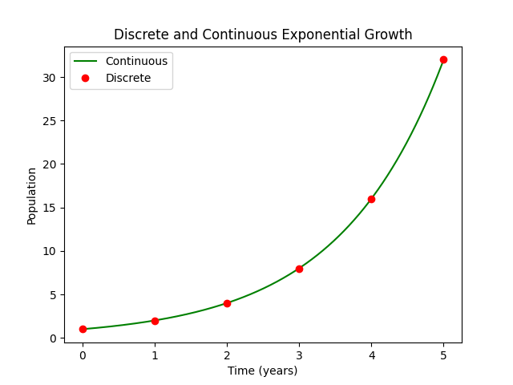

Since exponential growth has been so much in the news lately, let's take a quick look at it!

## Continuous Case

_Exponential growth_ refers to the case where a population of something (birds, diseased people, radioactive particles of some sort) changes at a rate that is strictly proportional to how many of that thing there already are. For instance, in the case of bacteria, a single bacterium may split once a day. Then at the initial point in time there will be just one bacterium; the next day there will be two (increased by 1 bacterium / day); the day after there will be 4 (an increase of 2 bacteria / day) and so on and so forth. In this case the constant of proportionality was one (the rate was the same as the population), but in general there's no reason that that needs to be the case. We can express this mathematically, for a population $P$ evolving with a constant of proportionality $k$ over time $t$ as

$$
\frac{dP}{dt} = k P(t)
$$

Using separation of variables and assuming that $P(0) = P_0$, we can find a closed-form solution:

$$
\begin{align*}
\frac{dP}{dt} &= k P(t) \\
\int \frac{1}{P(t)} dP &= \int k dt  \\
\ln |P(t)| &= kt + C \\
P(t) &= e ^ {kt + C} \qquad \text{(Assuming P(t) > 0)} \\
 &= e^C e^{kt} \\
 &= A e^{kt} \\
P_0 &= A e^ {k \ast 0} \\
P_0 &= A \\
\therefore P(t) &= P_0 e ^ {kt}
\end{align*}
$$

## Discrete Case

This is the solution for a population evolving continuously. However, we may want to consider the case where the population is either evolving discretely or where we can imagine that it does. For instance, our initial example with the bacteria could be better modelled via a discrete process where at a time $t$, the population $P_t = kP_{t - 1}$. In this case, our closed-form solution for a given time step $t$ where the initial population is $P_0$ is $P(t) = P_0 k ^ t$. Let's prove this inductively:

Base case: $t = 0$. Then $P_0 = P_0 k ^ 0 = P_0$, as predicted.

Induction step: Let's say that this holds for time $t - 1$. Then $P_t = k P_{t - 1} = k \left( P_0 k^{t - 1} \right)  = P_0 k^t$.

So that proves it then!

## Converting Between Them

Now let's take a look at how we can switch back and forth between these models. One case where we might want to do this if if the population if changing continuously, but we can only sample it discretely - for instance, we might only be able to check the population size once a year. Our data are discrete, even though the underlying phenomenon isn't. If we do this, we'll find a (discrete) $k_d$, but we want to convert it to a continuous $k_c$. It turns out that doing so isn't too difficult:

$$
\begin{align*}
P_{t + 1} &= k_d P_t \\
\frac{P_{t + 1}}{P_t} &= k_d \\
\frac{P_0 e^{k_c(t + 1)}}{P_0 e^{k_c t}} &= k_d \\
\frac{P_0 e ^{k_c t} e^{ k_c }}{P_0 e^{ k_c t }} &= k_d \\
e^{k_c} &= k_d \\
k_c &= \ln k_d
\end{align*}
$$

Now let's double-check our math graphically. Let's say we check a population of mice once a year, and find that each year the population is twice that of the previous year. That means that $k_d = 2$, and so $k_c = \ln 2 \approx 0.693\dots$. If we plot the population growing discretely with $k_d = 2$ and continuously with $k_c = \ln 2$, we should find that the plots coincide. Plotting was done using MatPlotLib.

`embed:resources/exponentials.py`

Just by looking at it, we can see that we were bang on!
