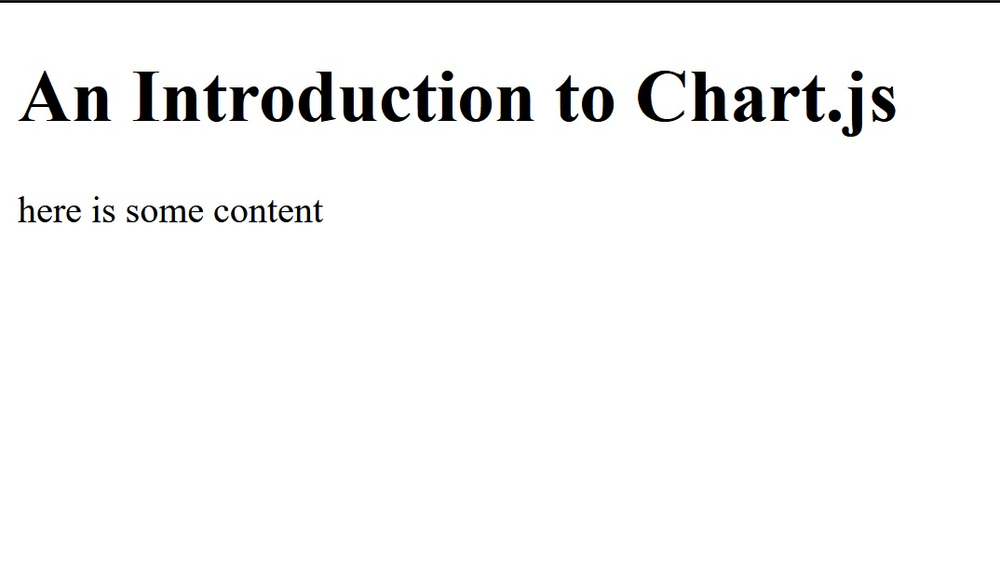
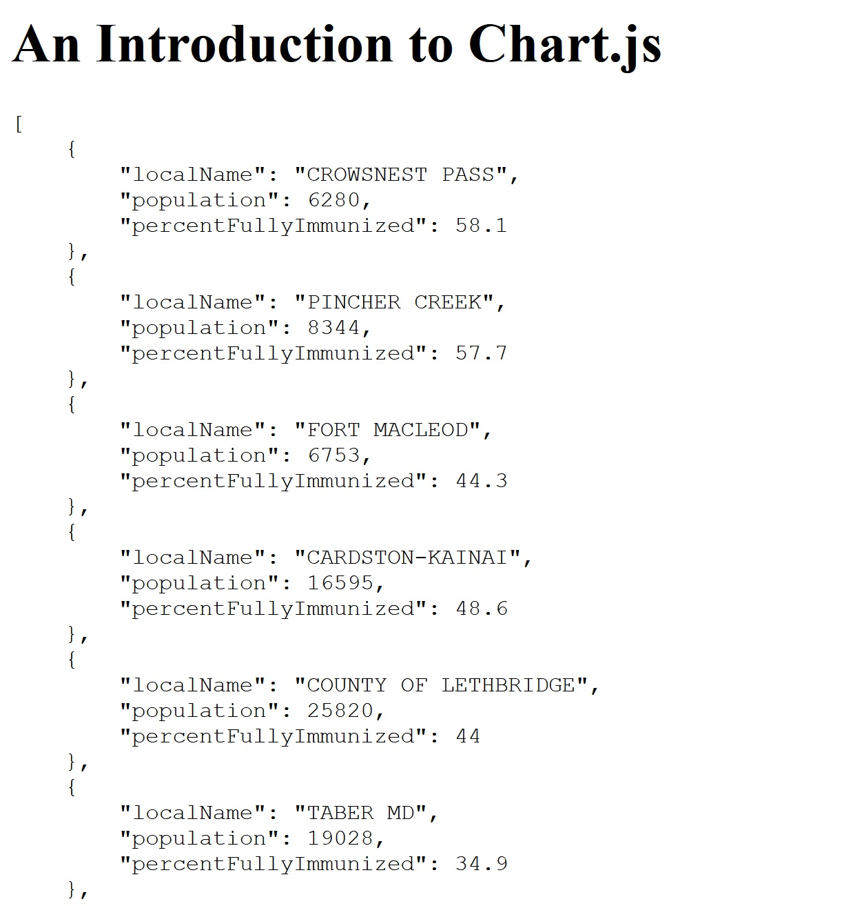
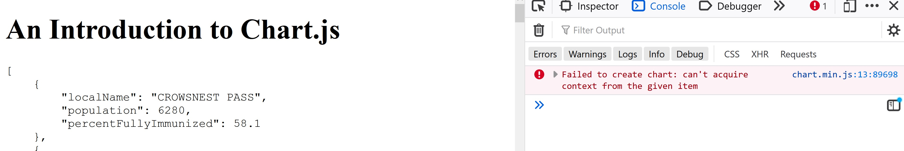
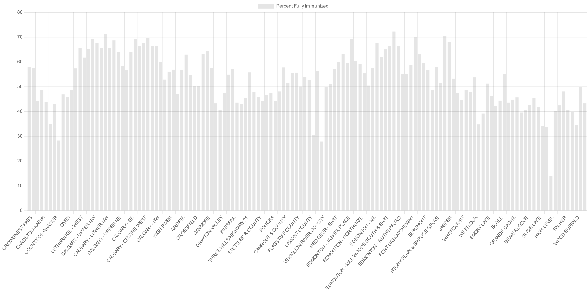
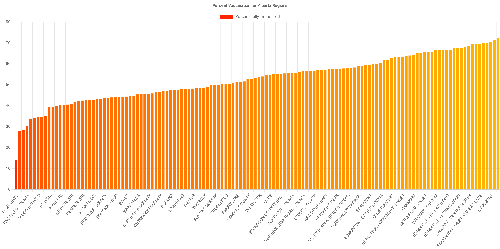
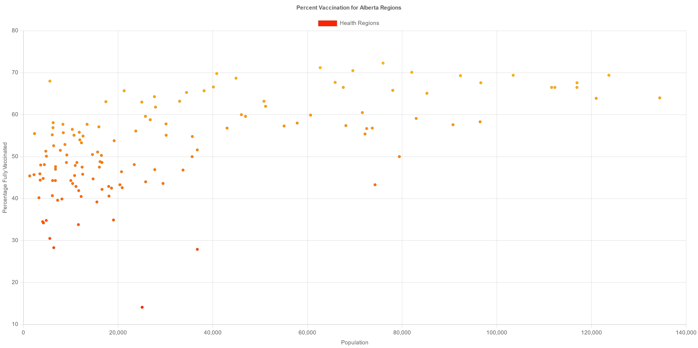
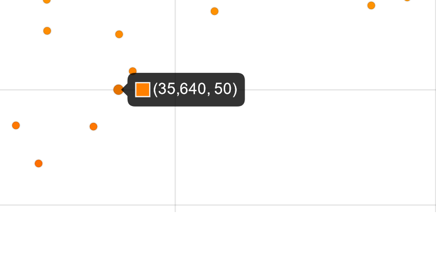
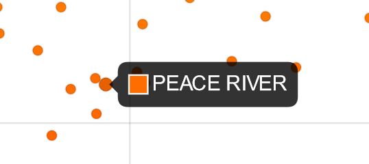
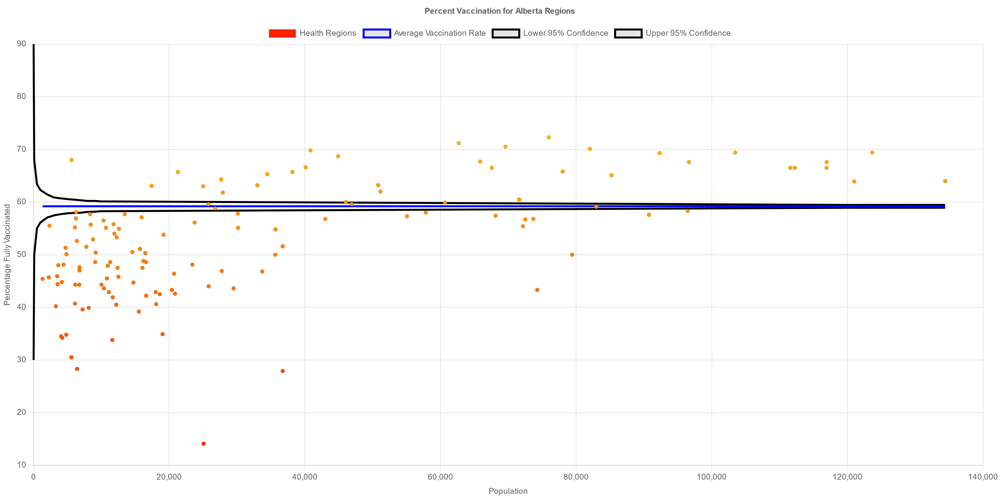
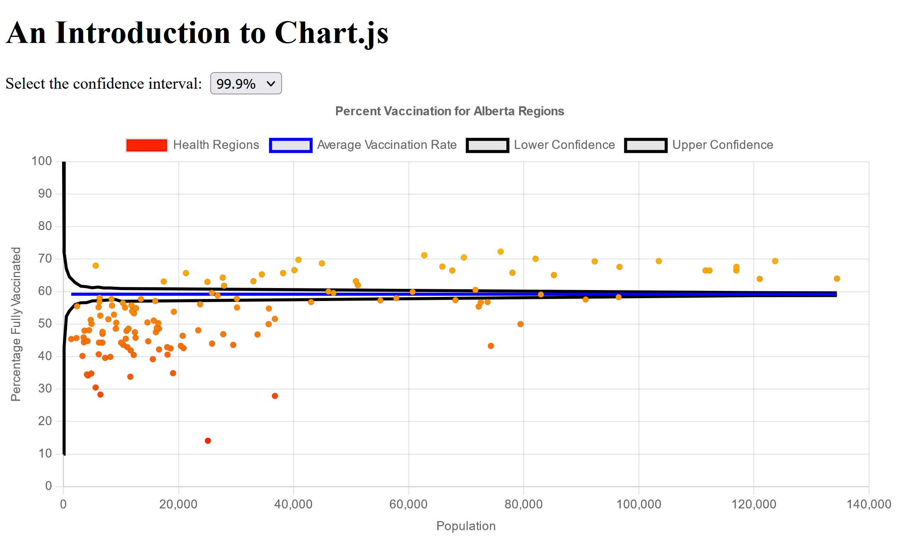

Being able to visually examine data, or present data in an aesthetic manner, is incredibly important! In addition to many people perferring to learn things visually, making your data visible can allow you to spot patterns and test hypotheses more quickly. Although there are many different solutions for creating beautiful charts on the web, today I'm going to use [Chart.js](https://www.chartjs.org/) to examine the COVID-19 vaccination data for different regions in the province of Alberta. The finished project can be found at [this GitHub repository](https://github.com/EricRobertCampbell/learning-chart-js).

## Before We Get Started

The basic idea of this project is to use some very simple data visualization to examine the COVID-19 vaccination rates for different regions in the province of Alberta. We're going to look at the major features of the Chart.js library by examining the data in a few ways:
1. A simple bar graph of the vaccination rate by region
2. A simple scatter plot of the regions by population and vaccination rate
3. An examination of whether the differences that we see can be explained by differing populations using a variation on a [funnel plot](https://en.wikipedia.org/wiki/Funnel_plot) with different confidence intervals.

I'm also going to do this the 'old-fashioned' way - pure HTML, CSS, and JavaScript (and precious little CSS at that). In some cases that is going to lead to some slightly strange choices - I hope that the simplicity and reduced opportunity for errors makes up for that. I will discuss some of these choices and what should (or could) be done at the end.

### Creating the Project

Let's start by setting up the basic structure of the project - creating the index.html file as well as the files and folders for the JavaScript and CSS.

```bash
mkdir learning-chart-js
cd learning-chart-js
touch index.html
mkdir scripts styling
touch scripts/script.js
touch styling/styles.css
```

Once that's done, running `ls -R` (list everything, recursing into directories) should give you the following:
`embed:resources/stage1listing.txt`

The next reasonable step would be to create the HTML:
`embed:resources/index-1.html`

We'll worry about the JavaScript and CSS later - for now we just want to ensure that the basics work. Opening up the page in your browser should display the following:




### Getting, Massaging, and Incorporting the Data

Now that we have the basics of the site, we should actually get the data that we would like to analyze. The government of Alberta publishes [CSV files with detailed pandemic information](https://www.alberta.ca/stats/covid-19-alberta-statistics.htm#data-export) on a (usually) daily basis. For our purposes, we want the [vaccine data](https://www.alberta.ca/data/stats/lga-coverage.csv), so go ahead and grab that. I downloaded the file containing data up to September 2; if you would like to follow along exactly you can grab [the exact file as a gist](https://gist.github.com/EricRobertCampbell/08b5ed4f73b00a10165193aaeb2bdfcf). I've put the file into a newly created `data` directory. The first few lines of the file should look as follows:

`embed:resources/lga-coverage-head.csv`

While this is great, there are a few things that we would like to fix:
1. For our purposes, we really don't care about all the data - we just want the data for the entire population (not segregated by age) of each region, along with the population of that region and the vaccination rate. Even more than that, we only care about the *full* vaccination rate - that is, the rate for people with both doses.
2. This is not directly accessible in JavaScript.

To fix both of these issues, we're going to create a quick [node.js](https://nodejs.org/en/) script to process the file and output a [JSON](https://developer.mozilla.org/en-US/docs/Learn/JavaScript/Objects/JSON) with the relevant data.

```bash
cd data
touch processData.js
```

The newly created `processData.js` file should look as follows:

`embed:resources/processData.js`

To run it:
```bash
node processData.js
```

If everything went as planned, there should now be a file `condensedData.json` containing the data that we generally care about.

However, there is no really good way (that I am aware of) to make this data natively available to our JavaScript, so we are now going to do something slightly horrific and _manually copy the contents of the JSON file into `scripts/script.js`_. While we're at it, we're going to ensure that it is actually loaded by displaying its contents in a `<pre>` tag that we'll need to create in `index.html`.

`embed:resources/index-1-2.diff`
`embed:resources/script-1.js`

If you look at the website again, it should now look as follows:



### Loading in Chart.js
Now that we have access to our data, we need access to Chart.js! Following the [excellent instructions at the Chart.js homepage](https://www.chartjs.org/docs/latest/), we can grab the latest version from the [Chart.js CDN](https://www.jsdelivr.com/package/npm/chart.js). Now we just need to add it to our website. If you want to follow along exactly be sure to grab that same version that I am using! We'll also want to create a new dummy `Chart` to ensure that the library was loaded correctly.

`embed:resources/index-2-3.diff`
`embed:resources/script-1-2.diff`

Note that although the appearance of the website will not have changed, you should see an error if you open up the developer console:



This is expected - it is the result of not providing a place to actually render the new chart. We'll take care of that very soon!

## A Simple Bar Graph
(To start right from here, begin from [this commit](https://github.com/EricRobertCampbell/learning-chart-js/commit/14e33086e382c207c1e9135000602641329edfce))

So far we have done a lot of processing and setup, but haven't actually created a chart! Let's rectify that. Our first chart will be a simple bar graph comparing the vaccination percentage for each different region. We'll need to do two things:
1. Create a `<canvas>` element in `index.html`; the actual graph will be plotted here.
2. Update `script.js` to provide the appropriate data to create the graph

`embed:resources/index-3-4.diff`
`embed:resources/script-2-3.diff`

When you open up the website, you should see the following chart greet you:




In order to create this, we had to create a new `Chart` object. This chart is drawn into a canvas element though a 2D context, which is what we passed into the constructor as the first argument. The second argument specified what the chart should actually look like. In our case, we indicate that it is a bar graph, and that the labels (x axis) should be the local name while the value (y axis) should be the percentage vaccinated. Notice that `datasets` is an array - if we wanted we could specify multiple datasets and have them all displayed on the same set of axes.


While this is pretty nice right off the bat (for instance: hover over one of the bars and it will tell you some information about it!), there are a few things we could do right away to make it nicer. For instance, the regions as not ordered nicely, it lacks a title, and each of the bars is an identical, rather dull colour. 

To help us understand the data, we'll order the regions based on their percent vaccinated - from lowest to highest.

The title itself isn't bad to add - we just add the title as a plugin. It turns out that there are [a lot of options for the title](https://www.chartjs.org/docs/next/configuration/title.html), but we'll keep it simple and just have a plain text title.

For the colour we can be a little more creative. To make the graph a little easier to grab information from at a glance, let's colour a bar with a 0% vaccination rate red and one with a 100% vaccination rate green, and ones between those value coloured proportionally.

`embed:resources/script-3-4.diff`

And we immediately see a much nicer chart:



## Scatter Plot
(To start right from here, begin from [this commit](https://github.com/EricRobertCampbell/learning-chart-js/commit/5ffb8d902b7486a1f4e36fb6eb24ad1ac8e35baf))

Looking at this (beautiful) chart, something that I noticed is that the regions at the far left (with low vaccination rates) are either regions that I know have a small population, or ones that I have not heard of (perhaps because of their small population?). In contrast, the regions in the far right, with (relatively) high vaccination rates, are regions in Calgary and Edmonton, with presumably higher populations. However, I could also be wrong - I don't actually know how the health regions are decided. So, let's find out! We'll create a scatter plot of the data, with population plotted on the x axis and perccent vaccinated on the y axis. While we're at it, let's add labels to the axes to help us with interpreting the data.

`embed:resources/script-4-5.diff`

And again, a beautiful chart is the result:




Notice that the format for the data has changed - instead of just being a list of values (to match against the labels, as with the bar graph), we create a new object with its own $x$ and $y$ coordinates representing each point. This is the only data format which the scatter plot accepts.

Again, while this is lovely, there is one problem that we'd like to solve: when you hover over a point, it just displays the coordinates! Ideally, we'd like to display the name of the region instead.



In order to control the displayed tooltip, we need to provide a callback function which will generate the label for each point. Unfortunately, at the moment the points don't have any information about which health region they come from - we'll have to add that into the data!

`embed:resources/script-5-6.diff`

Now when we hover over a point, we get a much more informative tooltip.


The callback function which we provided was provided a context object, which contains a wealth of information about the individual point and the graph itself. Included in that is the `raw` attribute, which is the data point itself. We amended our passed-in data with the `label` attribute, which is actually ignored by Chart.js. However, we were then able to grab that value in the callback and use it as the value of the labe displayed in the tooltip. As with everything else in Chart.js, there is a lot more that you could do with tooltips, and the [documentation is an excellent place to start](https://www.chartjs.org/docs/3.4.0/configuration/tooltip.html).


## Updating 
(To start right from here, begin from [this commit](https://github.com/EricRobertCampbell/learning-chart-js/commit/9085079da5d65b08df159c70637dba7ce0490c6c))

Looking at this chart, it seems pretty clear that there is a connection of some sort between the population size and the vaccination percentage - it really looks like the larger the population, the higher the percentage. If we were interested in that, we could perhaps find a line of best fit and look at the slope. However, for now we're going to do something a bit different. We'll take the position that perhaps there is no (real) relationship between the population and the vaccination rate - perhaps what we're seeing is just an expression of the fact that in a smaller population, we would expect to see more variability. After all, it wouldn't shock you to flip a coin twice and get all heads, but it would certainly suprise you to flip that same coin 100 times and get the same result!

In order to explore that possibility, here's what we'll do. First, we'll calculate the average percent of the population that is vaccinated, and display that as a line on our graph. Next, we're going to pretend that getting vaccinated is a [Bernoulli process](https://en.wikipedia.org/wiki/Bernoulli_process) with $p$ being the average vaccination rate, and we'll construct a 95% confidence interval around the mean. To do so, we'll use a [Monte Carlo simulation](https://www.ibm.com/cloud/learn/monte-carlo-simulation) to generate the interval empirically.

`embed:resources/script-6-7.diff`

Which gives us the following chart:



If our assumptions were correct, we would expect 95% of the data to fit within the two black bands. Instead, almost none of it does! This lends some credence to our original idea that population size and vaccination rate are related, but of course there would be much more work to do to establish that.

Before we decide that we're done with this whole enterprise, there's one more thing that we should do. Our choice of a 95% confidence interval on which to base our analysis was fairly arbitrary - what if we were interested in different intervals? Let's add in the ability for the user to select a variety of intervals, and have the graph change when a new one is selected.

`embed:resources/index-5-6.diff`
`embed:resources/script-7-8.diff`

Which results in the following:



There's actually quite a bit going on here, so let's take a look at some of the highlights. First, we want to move the chart object out of the `setup` function, since it will now be changed in a few different places. In the `setup` function, we set the data for the confidence intervals to empty arrays - before the user selects it, we want it to be blank. We also created the `updateChart` function, which updates the chart data with the new confidence interval calculations and updates the chart using `chart.update()`. Finally, we add an event handler to the select element which we created in `index.html` so that changing the confidence interval updates the graph.

## Conclusion and Areas for Improvement

So there we have it! We created a simple bar graph and scatter plot, added a line graph, and learned how to update a graph with new data. We also took a look at some simple methods of improving the aesthetic appeal of the chart itself. And hopefully, we learned something about COVID-19 vaccination rates in Alberta!

While the primary intent was to explore Chart.js using a topic that was (at least to me) somewhat interesting, there are a lot of ways that it could be improved!

First, hard-coding the data in was quite painful. Since the Alberta Government makes the data so readily available anyway, an obvious improvement would be to load in that data (using `fetch`, probably) when the page loads. This would also make it so that the data is automatically up to date - after all, we just got the most recent data on load!

Second, the site itself is not very aesthetically pleasing. It could certainly use some CSS!

Third, calculating the confidence intervals takes a noticeable amount of time, and during that time the webpage is unresponsive. Some sort of indication (a spinner?) that there is a calculation happening would make the whole interaction more pleasant. Since the calculations are so time-consuming, and there are only a few values that the confident interval can take, it would also make sense to memoize the result in some fashion as well.

However, despite these shortcomings I think that the result is still pretty interesting, and I certainly enjoyed coding something up without the use of external libraries. Good luck!
