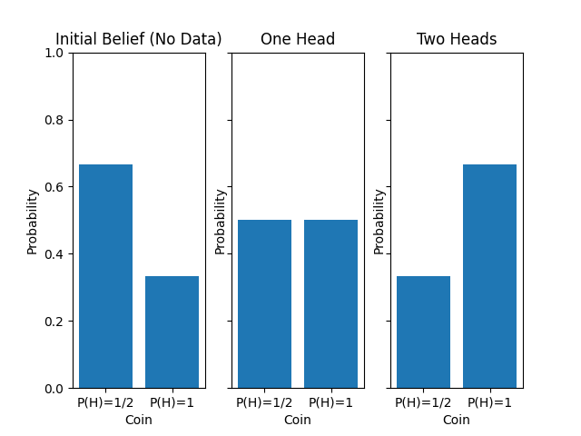

## Introduction

Let's take a look at how we can use Bayes' Theorem to update our beliefs about a situation, given some data!

## The Problem and Solution

Imagine that you are in the following situation.

> You have a box in front of you. You know that in the box are two regular coins (R), with a probability of flipping Heads of $\frac{1}{2}$, and on trick coin (A), which always lands on Heads. You choose a coin at random from the box and flip it, resulting in Heads. Which coin do you think it was?

This is a classic problem for Bayes' Theorem - we have a result, and want to reason "backwards" to the causes. Let's apply the theorem to calculate the probability of the coin being a regular coin or a trick coin.

Bayes' Theorem is

$$
P(A|B) = P(A) \frac{P(B|A)}{P(B)}
$$

Let's start by calculating the probability that the coin we flipped was regular. Then we have

$$
\begin{align*}
P(R|H) &= P(R) \frac{P(H|R)}{P(H)} \\
		&= \frac{2}{3} \ast \frac{\frac{1}{2}}{P(R)P(H|R) + P(A)P(H|A)} \\
		&= \frac{\frac{1}{3}}{\frac{2}{3} \ast \frac{1}{2} + \frac{1}{3} \ast 1} \\
		&= \frac{\frac{1}{3}}{\frac{2}{3}} \\
		&= \frac{1}{2}
\end{align*}
$$

Although at this point we can clearly reason out that the probability that it is the all-Heads coin is also $\frac{1}{2}$, let's go through the work anyway.

$$
\begin{align*}
P(A|H) &= P(A) \frac{P(H|A)}{P(H)} \\
		&= \frac{1}{3} \ast \frac{1}{\frac{2}{3}} &(\text{$P(H)$ calculated above}) \\
		&= \frac{\frac{1}{3}}{\frac{2}{3}} \\
		&= \frac{1}{2}
\end{align*}
$$

Before we move on, let's examine the result that $P(H) = P(R)P(H|R) + P(A)P(H|A)$. If we wanted to be slightly more explicit, we could express this as

$$
\begin{align*}
P(H) &= P(H \& R \text{\ or\ } H \& A) \\
	&= P(H \& R) + P(H \& A) \\
	&= P(R)P(H|R) + P(A)P(H|A) \\
\end{align*}
$$

using the conditional probability formula. Note that this is actually independent of which condition (regular coin or all heads) we are actually dealing with.

Now let's say that we flip the coin again, and again it is heads. What does this do to our belief about the nature of the coin?

Again, let's go through the calculations:

$$
\begin{align*}
P(R|HH) &= \frac{P(R|H) P(H|R)}{P(HH|H)} \\
		&= \frac{\frac{1}{2} \ast \frac{1}{2}}{\frac{1}{2} \ast \frac{1}{2} + \frac{1}{2} \ast 1} \\
		&= \frac{1}{4} / \frac{3}{4} \\
		&= \frac{1}{3}
\end{align*}
$$

and

$$
\begin{align*}
P(A|HH) &= \frac{P(A|H) P(H|A)}{P(HH|H)} \\
		&= \frac{\frac{1}{2} \ast 1}{\frac{3}{4}} \\
		&= \frac{2}{3}
\end{align*}
$$

So, as expected, as we continue to flip heads our belief that the coin that we have is the all-Heads one grows and grows.

Let's take a look at these results graphically:

Notice the relabelling of the coins.

If we didn't know better, those would look like the graph of probability distributions on the nature of the coin! In fact, that is exactly what those are. By calculating all of our degree of belief in the nature of the coin, we are exactly creating a distribution over it!

## Bayes' Theorem for Distributions

Although it may not be clear at the moment, what we are doing when updating our beliefs in this manner is using a version of Baye's Theorem for an entire distribution, rather than a point estimate of a probability. This version of Baye's Theorem, for a distribution $f$ on an unknown variable $\theta$ is

$$
f(\theta | \text{data}) = f(\theta) \ast \frac{f(\text{data} | \theta)}{f(\text{data})}
$$

In fact, we can go even further. We know that the posterior distribution will be a probability distribution, and so must sum to 1. As such, we can view the marginal ($f(\text{data})$) as a normalizing factor to ensure that this is the case. Thus, we can express this same idea as

$$
\text{Posterior\ } \propto \text{Prior\ } \ast \text{Likelihood}
$$

## Conclusion

We began with a simple problem which we could solve using Bayes' Theorem. During that problem, we updated our beliefs about the probability of the nature of a coin, and used that to motivate the idea of this update as updating a _distribution_ rather than merely a point estimate. We then extended that (with very little justification) to two formulations of Bayes' Theorem for Distributions.
