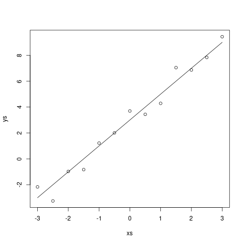
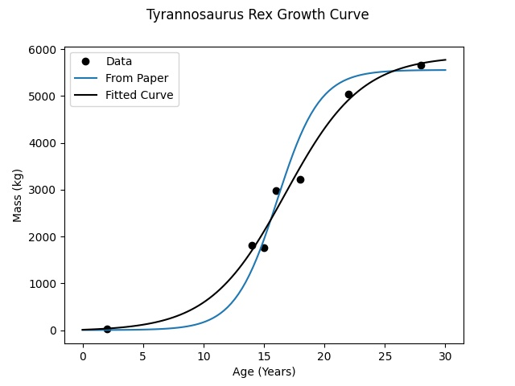
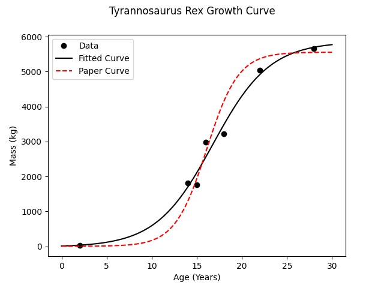

## Introduction

Lately, I've become more interested in paleontology and have started to read more and more scientific papers on the subject. I've also become more initerested in statistics, so to improve at both of these, have begun to try to recreate simple statistical analyses from the papers. In this article, I'm going to (attempt to) recreate the growth curve for _Tyrannosaurus rex_ as found in [(Ericson, et. al. 2004)](https://www.nature.com/articles/nature02699). To do so, I am going to need to fit a logistic curve to the data they collected, using SciPy's `curve_fit` function!

## An Example - Linear Regression

To begin with, let's start with the simplest application of `curve_fit`: performing a linear regression. Let's generate some fake data to start. The data itself will be of the form $y = 2x + 3 + \epsilon$, with $\epsilon \sim N(0, 1)$.

`embed:./resources/generate_linear_data.r`

The data itself looks as follows:

`embed:./resources/linear_data.csv`



Now let's fit the data! The general shape of the `curve_fit` function is `curve_fit(f, xdata, ydata)`. Here, `f` is a callable (a function) which takes in an $x$ value as its first parameter and then the actual parameters to be fit as the others: `f(x, *params)`. What `curve_fit` is attempting to do is find the parameters which minimize the least-squares distance between `f(xdata, *params)` and `ydata`. Nominally, we expect `ydata = f(xdata, *params)`.

The return value for `curve_fit` is `[popt, pcov]`, where `popt` are the optimal parameters and `pcov` is the [variance-covariance matrix](https://en.wikipedia.org/wiki/Covariance_matrix) between the different parameters. For now, we will be mostly ignoring `pcov`.

So what does this look like for us? Well, we want to fit a linear function of the form $f(x) = mx + b$, so we will have two parameters: $m$ and $b$. Our function in Python will look like

```python
def linear_curve(x, m, b):
	return m * x + b
```

The entire program to load in the data, find an optimal solution, and plot it are as follows:

`embed:./resources/fit_linear_curve.py`


We can see that we are getting a good agreement between the actual function used to generate the data and what we extracted using curve fitting.

## Fitting a Logistic Curve

Now that we have an idea of how the function works, let's take a look at what we actually want to do: fit a [ logistic curve ](https://en.wikipedia.org/wiki/Logistic_function) to some _Tyrannosaurus_ growth data! First, let's take a look at the data.

| Age (Years) | Mass (kg) |
| ----------- | --------- |
| 28          | 5654      |
| 22          | 5040      |
| 18          | 3230      |
| 16          | 2984      |
| 14          | 1807      |
| 15          | 1761      |
| 2           | 29.9      |

(Data from [Erickson et at 2004](https://www.nature.com/articles/nature02699) Table 1)

For our purposes, let's fit this with a very general logistic curve:

$$
f(x) = \frac{A}{1 + e^{-k(x-x_0)}} + E
$$

So now we have four parameters instead of two, but apart from that the process is the same. So, let's load in the data, fit the curve, and plot the results!

`embed:./resources/fit_logistic1.py`

Disaster! If you try running this you get a very nasty looking error:

`embed:./resources/error1.txt`

Although the error is somewhat cryptic (unless perhaps you spend a lot of time with this function), it turns out the issue is that it was not correctly able to fit the curve because the actual parameters are too far away from the initial parameters.

Wait, I hear you say - what initial parameters? We didn't pass any in! It turns out that if you consult [the documentation for `curve_fit`](https://docs.scipy.org/doc/scipy/reference/generated/scipy.optimize.curve_fit.html), it begins the search with all parameters set to the value of 1! In our case, we can cheat a little bit - the actual parameter values found in ([Erickson et. al. 2004](https://www.nature.com/articles/nature02699)) are $A=5551$; $k=0.57$; $x_0=16.1$; and $E=5$, which are all quite different from 1!

So, how do we ask the function to start the curve at these parameter values? We simply have to pass in the `p0=initial_params` keyword argument to the function. So, let's do exactly that:

`embed:./resources/fit_logistic_1_2.diff`


Again, just by visually inspecting this we can see that this is a very reasonable regression curve for the data!

## Analysis

This is pretty fantastic - we were very quickly and easily able to fit a curve to the data! Unfortunately, as you may have noticed, the parameters that we found are _not_ those found in the parper. In fact, we can plot the values that they gave against ours to see the difference:


`embed:./resources/fit_logistic_2_3.diff`

I may be biased, but the curve that we found seems to fit the data better. In fact, we can say empirically that it does - if you find the sum of mean squared errors for our fitted curve against the one from the paper, you find a higher sum of errors for the paper, which means that ours is a better fit to the data.

But why is this the case? The authors of the paper are clearly very intelligent and fitting a logistic curve to data is not exactly a difficult process, even accounting for the fact that 2004 was a great many years ago.

It turns out that I was not the only person who had some trouble replicating the results; [ (Myrhold, 2013) ](https://journals.plos.org/plosone/article?id=10.1371/journal.pone.0081917) also noted that the published regression equations were not the best fit (for the _Tyrannosaurus_). In response, Erickson, et. al. published a [corrigendum](https://www.nature.com/articles/nature16487) explaining their choices, which basically boil down to the fact that the fitted regression models produces values, especially for newly hatched or very old individuals, which are biologically infeasible. For instance, they noted that a regression equation produced masses at hatching (54kg) which is impossible, due to the nature of egg-laying.

And frankly, none of that is terribly important. A (the?) main question which Erickson, et. al. were trying to answer was how tyranosaurs attained thir massive sizes - either by growing faster or growing longer. In all of the analyses, the conclusion was the same - rather than growing for _longer_ in order to attain their mazimum size, they grew _more quickly_.

## Next Steps

There is obviously lots that we could do to further this analysis! One thing that stood out to me is that there is not a lot of time given to the uncertainty inherent in the measurements. In particular, there is a great deal of uncertainty in the estimates of the body masses, and none of that was reflected in the results. In addition, the selection of parameters to constrain the biological infeasability of the results made it harder to replicate the results. It would have been interesting to redo the analysis using a Bayesian framework, where the assumptions (e.g. 5kg at hatching) could have been encoded as strong priors on the parameters rather than fixing them in the analysis. In fact, that approach would also lend itself to an analysis incorporating the uncertainty in the masses!

Perhaps that will be something fun to do later...

## Conclusion

SciPy's `curve_fit` function allows you to fit an (almost) arbitrary regression function to observed data by generating optimal values for the function parameters. We used this first to perform a simple linear regression, and then to fit a logistic growth curve for _Tyrannosaurus rex_.

## Sources and Bibliography

-   [ Erickson, G. M., Makovicky, P. J., Currie, P. J., Norell, M. A., Yerby, S. A., & Brochu, C. A. (2004). Gigantism and comparative life-history parameters of tyrannosaurid dinosaurs. Nature, 430(7001), 772–775. https://doi.org/10.1038/nature02699](https://www.nature.com/articles/nature02699)
-   [Erickson, G. M., Makovicky, P. J., Currie, P. J., Norell, M. A., Yerby, S. A., & Brochu, C. A. (2016). Correction: Corrigendum: Gigantism and comparative life-history parameters of tyrannosaurid dinosaurs. Nature, 531(7595), 538–538. https://doi.org/10.1038/nature16487](https://www.nature.com/articles/nature16487)
-   [Myhrvold, N. P. (2013). Revisiting the Estimation of Dinosaur Growth Rates. PLOS ONE, 8(12), e81917. https://doi.org/10.1371/journal.pone.0081917](https://journals.plos.org/plosone/article?id=10.1371/journal.pone.0081917)
-   [SciPy - Documentation for `curve_fit`](https://docs.scipy.org/doc/scipy/reference/generated/scipy.optimize.curve_fit.html)
-   [Wikipedia - Covariance Matrix](https://en.wikipedia.org/wiki/Covariance_matrix)
-   [Wikipedia - Logistic Curve](https://en.wikipedia.org/wiki/Logistic_function)
