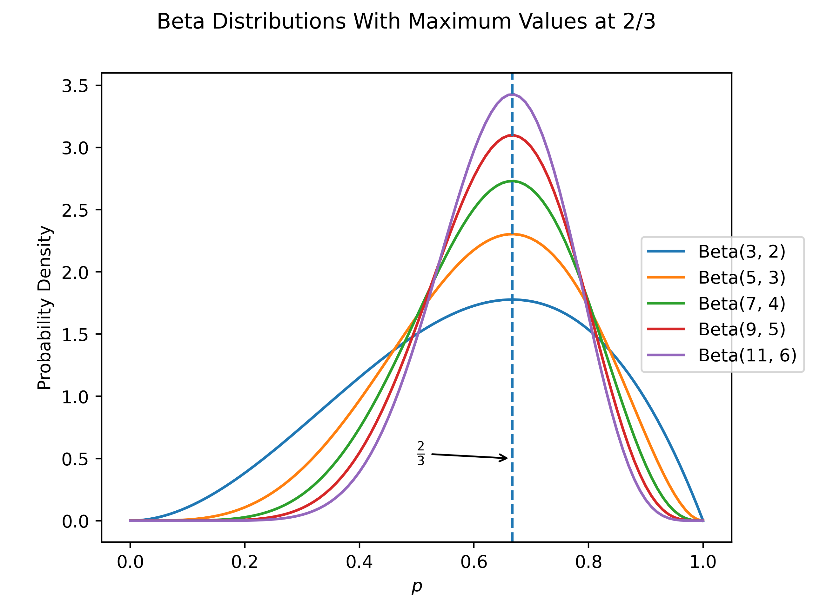
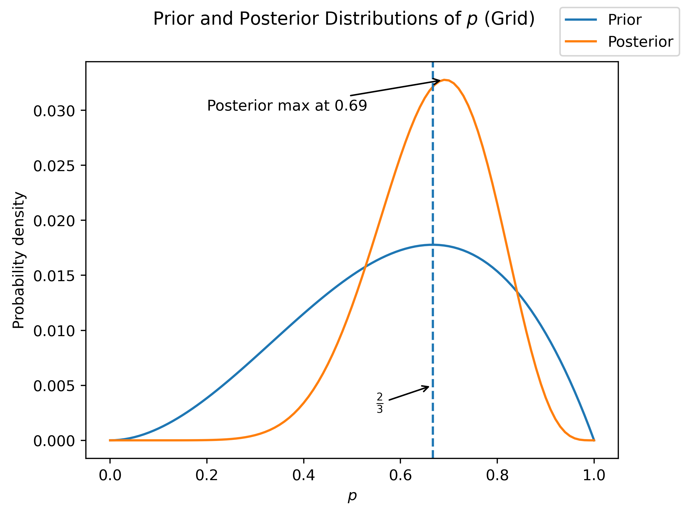
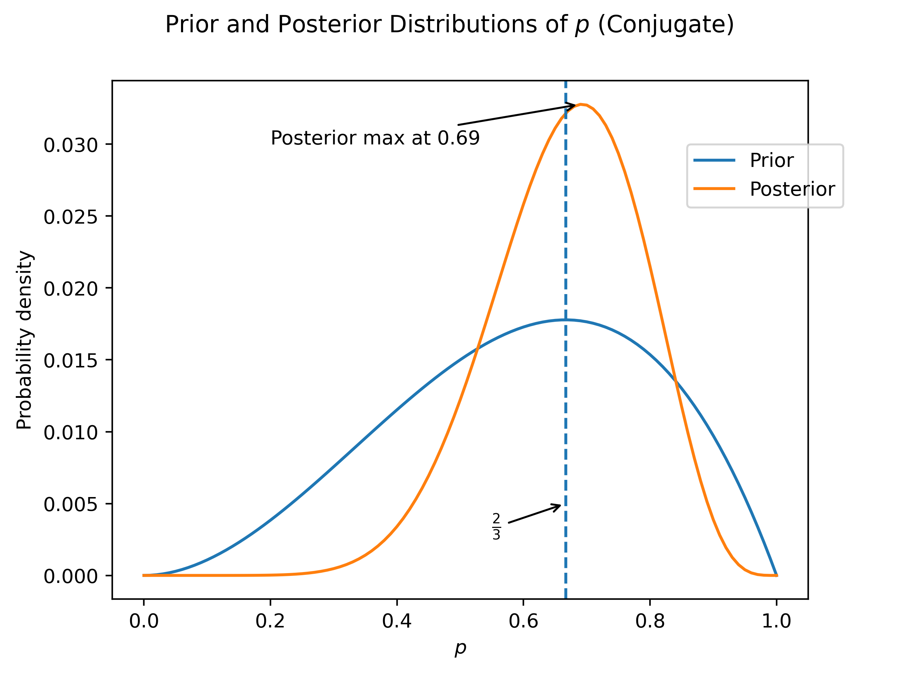

## Introduction

For a given problem in Bayesian statistics, there can often be more than one way to solve it. In this article, we'll take a very simple problem from _Statistical Rethinking_ by Richard McElreath and solve it in three different ways.

## Problem

(Adapted from _Statistical Rethinking_)

> Imagine that you are attempting to find out what proportion of the surface of the Earth is covered in water. Rather than, say, simply look this up, you decide to do an experiment. You have a globe nearby, and so you decide to throw the globe in the air, catch it, and record whether or not you index finger was covering land or water. You try this 10 times, and hit water 7 of them. What do you believe about the proportion of the Earth's surface which is covered in water?

First, let's say that the true proportion of water on the surface of the Earth is $p$, and for our purposes let's also say that that is the probability with which a given toss will end up with your finger over water. I vaguely remember that the propertion of the Earth's surface which is water is about 2/3, which we will represent using a prior which is distributed as $\text{Beta}(\alpha, \beta) = \text{Beta}(3, 2)$. Why did we choose this prior? For a few reasons. The beta and binomial distributions are tightly linked, and in particularly the Beta is the [conjugate prior](https://en.wikipedia.org/wiki/Conjugate_prior) of the binomial distribution, which we will use later to calculate a posterior distribution. We can think of the parameters $\alpha$ and $\beta$ as being somehow related to the number of successes and failures, respectively, of a binomial. To be slightly more accurate, we can think of $\alpha = \#\text{successes} + 1$, $\beta = \#\text{failures} + 1$, and the maximum likelihood value for the Beta pdf will occur at $\frac{\#\text{successes}}{\#\text{trials}} = \frac{\alpha - 1}{\alpha - 1 + \beta - 1}$. A slightly non-rigorous proof is as follows:

$$
\begin{align*}
p(x) &= \text{Beta}(\alpha, \beta) = \frac{1}{B(\alpha, \beta)} x^{\alpha - 1}(1-x)^{\beta - 1} \\
\frac{dp}{dx} &= \frac{1}{B(\alpha, \beta)}\left[ (\alpha - 1)x^{\alpha - 2}(1-x)^{\beta - 1} - x^{\alpha - 1}(\beta - 1)(1-x)^{\beta - 2}\right] = 0 \\
(\alpha - 1)x^{\alpha - 2}(1-x)^{\beta - 1} &= (\beta - 1)x^{\alpha - 1}(1-x)^{\beta - 2} \\
\frac{\alpha - 1}{\beta - 1} &= \left( 1 + \frac{\alpha - 1}{\beta - 1}\right)x \\
x &= \frac{\alpha - 1}{\beta - 1} \cdot \frac{\beta - 1}{\beta - 1 + \alpha - 1} \\
  &= \frac{\alpha - 1}{\beta - 1 + \alpha - 1} \\
\end{align*}
$$

(I feel OK about presenting this abbreviated proof because a visual examination of the Beta pdf shows just a single critical point at a maximum, so taking the final step of actually proving that the point which we found is a maximum seems superfluous, at least for our purposes).

The actual numbers we choose somehow reflect our level of conviction. Visually, we can see this if we plot various beta distributions where the ratio of successes / trials is the same but the actual values are different:

`embed:./resources/differentBetas.py`

Thus, our choice of $\text{Beta}(3,2)$ indicates that I think that the value of $p$ is about 2/3, but I am not very confident. If I wanted I could actually use non-integer values to indicate even more uncertainty, but this should be enough for now.

## Grid Method

So now we can use our first method to approximate our final distribution of the propportion $p$ of water on the Earth's surface - a grid approximation. For this, we will evaluate our prior and likelihood at a number of potential values for $p$, and then multiply them together. If we choose a sufficiently large number of points, our approximation should be a good one!

`embed:./resources/gridApproximation.py`

So we can see that with the addition of our data, we have shifted the maximum slightly and increased our confidence (decreased the spread / variance) quite a bit!

## Markov Chain Monte Carlo (MCMC)

Another method that we can use to estimate the distribution of the parameter $p$ is to use [Markov Chain Monte Carlo](https://machinelearningmastery.com/markov-chain-monte-carlo-for-probability/). This method is probably one of my favourites, from a purely aesthetic perspective. MCMC allows us to construct samples from a posterior distribution, _without ever calculating that distribution_! Instead, it constructs a Markov Chain which converges to the posterior. When I first learnt about it, it seemed like magic, and it still seems that way to me.

To begin with, let's be a little more formal about our model. In fact, we can write down how we believe our system works:

$$
\begin{align*}
k &\sim \text{Binomial}(10, p) \\
p &\sim \text{Beta}(3,2) \\
\end{align*}
$$

Where $k$ is the observed number of "water" hits (7), and $p$ is the true proportion of the Earth's surface which is covered in water.

In order to construct our estimate, we will use [PyMC](https://www.pymc.io/welcome.html). We will write down our model almost exactly the way it appears above, run it, and sample from the results.

`embed:./resources/mcmc.py`

    Auto-assigning NUTS sampler...
    Initializing NUTS using jitter+adapt_diag...
    Multiprocess sampling (4 chains in 4 jobs)
    NUTS: [p]

  <progress value='12000' class='' max='12000' style='width:300px; height:20px; vertical-align: middle;'></progress>
  100.00% [12000/12000 00:02<00:00 Sampling 4 chains, 0 divergences]

    Sampling 4 chains for 2_000 tune and 1_000 draw iterations (8_000 + 4_000 draws total) took 2 seconds.

Note that what we get from this process is _not_ a distribution, but instead a set of samples. In oder to approximate the distribution, we can use a [Gaussian Kernel Density Estimation (KDE)](https://mathisonian.github.io/kde/).

We can access the sampled values of the variable we are interested in, $p$, through the `samples.posterior` attribute. This attribute behaves like a dictionary where the keys are the names of the variables in the model. The actual samples are represented as an array of arrays, one for each of the chains used in the MCMC sampler. In order to get our combined sample, we simply combine the samples for each chain.

Unsuprisingly, we see very much the same results as with the grid approximation method. The main difference is that the posterior is now "bumpier", as a result of the discrete sampling. If we needed to, we could decrease this by increasing the number of samples. However, for now this is good enough.

## Conjugate Distributions

Our last method relies on the fact that we have a beta prior and a binomial likelihood, and that the beta is the [conjugate prior](https://en.wikipedia.org/wiki/Conjugate_prior) for the binomial. What does this mean? Simply that there is a closed-form solution for the posterior - no sampling or approximations required! in order to see why, let's say that we start with a prior which is $\text{Beta}(\alpha, \beta)$ and a likelihood which is $\text{Binomial}(k, n, p)$. Then we have that the posterior is proportional to their product. The following is a (not at all rigorous) sketch of what the proof might look like:

$$
\begin{align*}
\text{posterior distribution} &\propto \text{pdf of the prior} * \text{pdf of the likelihood} \\
 &\propto \text{pdf of the Beta} * \text{pdf of the Binomial} \\
 &\propto \frac{1}{B(\alpha, \beta)} x^{\alpha - 1} (1 - x)^{\beta - 1} \ast \binom{n}{k} x^k (1-x)^{n-k} \\
 &\propto x^{\alpha - 1}(1-x)^{\beta - 1} \ast x^k (1-x)^{n-k} \\
 &\propto x^{k + \alpha - 1} (1-x)^{n - k + \alpha - 1} \\
\end{align*}
$$

Which is proportional to $\text{Beta}(k+\alpha, n-k+\beta)$. Here we're being very loose about the fact that everything is proportional, since at the end of the day we want a probability distribution, and so we'll just divide out by whatever we need to in order to have the sum of probabilities be 1.

From this result, we should be able to get the prior analytically:

- $\alpha = 3$
- $\beta = 2$
- $n = 10$
- $k = 7$

So the posterior should be $\text{Beta}(7 + 3, 10 - 7 + 2) = \text{Beta}(10, 5)$.

`embed:./resources/conjugatePrior.py`

Again, the results are similar. However, the process was certainly much easier!

## So... Which One is Best?

The fact that we've gone and solved the same problem multiple times leads to the obvious question: which method is the best? As always, the answer is a disappointing "it depends". For a very simple problem like this, using a conjugate prior is both quick and easy. However, the number of times where your problem will be solved by a conjugate prior is vanishingly small. There just aren't that many distributions which are conjugate to each other. The grid method can be a good choice for problems which are similar to this one in that there aren't too many dimensions / variables. However, as the number of variables increases the computational complexity will rise as roughly $\text{grid size}^{\text{number of variables}}$, which is obviously problematic. Using MCMC is a good choice for problems where the number of variables is large, at least in comparison to the other kinds.

And of course, there is at least one other common method which I did not cover - a [quadratic (or Laplace) approximation](https://medium.com/analytics-vidhya/bayesian-inference-how-quadratic-approximation-works-40cc70e79fb0), where we assume that the posterior is approximately normal. The reason for its exclusion is simply that I don't use it very often, and so am not terribly familiar with it. However, it also has its strengths, particularly for quick solutions to low-dimensional problems.

## Conclusion

We solved a simple problem in Bayesian statistic using three different methods: a grid approximation, Markov Chain Monte Carlo, and using a conjugate prior. For this simple problem the conjugate prior was the preferred method, but the different approximation methods have their own strengths in solving more complex problems.

## Bibliography / Sources

- [Analytics Vidhya - Introduction to Bayesian Statistics: Part 2: How Quadratic Approximation Works](https://medium.com/analytics-vidhya/bayesian-inference-how-quadratic-approximation-works-40cc70e79fb0)
- [Machine Learning Mastery - Markov Chain Monte Carlo](https://machinelearningmastery.com/markov-chain-monte-carlo-for-probability/)
- [Matthew Conlen - Kernel Density Estimation](https://mathisonian.github.io/kde/)
- [McElreath, R. (2020). Statistical rethinking: A Bayesian course with examples in R and Stan (Second edition). Boca Raton London New York. CRC Press, Taylor & Francis Group.](https://xcelab.net/rm/statistical-rethinking/)
- [Wikipedia - Beta Distribution](https://en.wikipedia.org/wiki/Beta_distribution)
- [Wikipedia - Binomial Distribution](https://en.wikipedia.org/wiki/Binomial_distribution)
- [Wikipedia - Conjugate Prior](https://en.wikipedia.org/wiki/Conjugate_prior)
