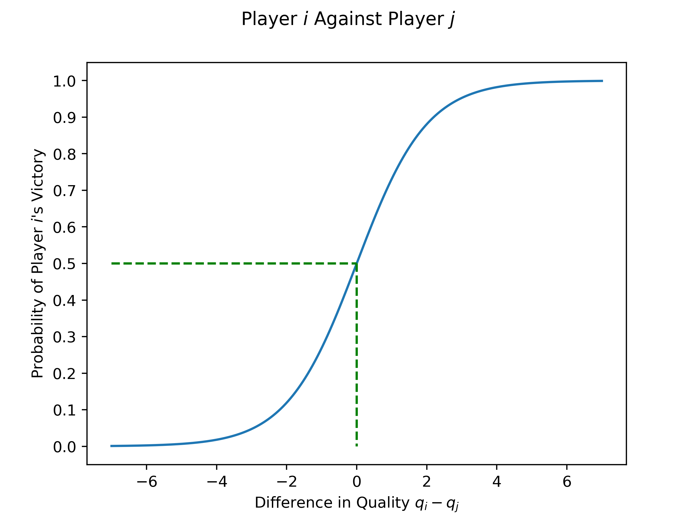
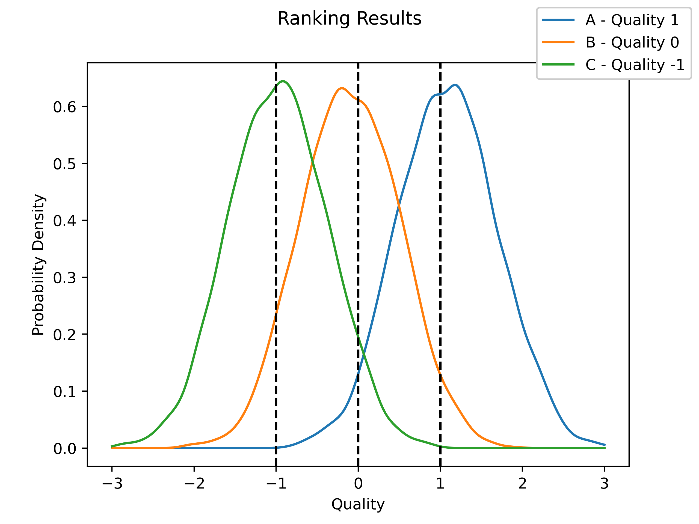
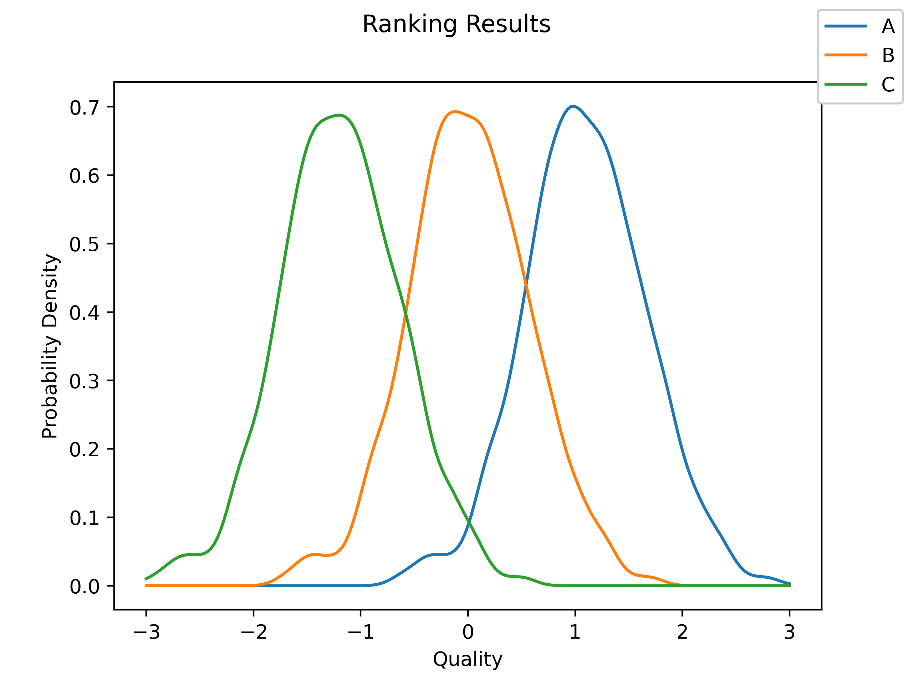

The purpose of this is to construct some sort of ranking given a series of pairwise comparisons, as well as an extension where the data is presented not as a series of one-on-one contests, but as a ranked order instead.

## Theory and Simple Application

Let's start with the basic idea. Imagine that you have some things that you want to rank. These could be movies, people, shapes - anything at all, as long as any two of them can be compared. For now, let's make this concrete: imagine that we are ranking players playing tennis. We assume that each player has some sort of inherent quality $q_i$, and that if player $i$ plays against player $j$, the probability of player $i$ winning is given by the logistic curve

$$
P(\text{$i$ wins against $j$}) = \frac{1}{1+e^{-(q_i - q_j)}}
$$

Let's take a look at the graph:


`embed:./resources/plot_logistic.py`

For the diagram, we can see that this way of calculating the probability of victory is at least reasonable. If player $i$ is much better than player $j$ (difference is large and positive), then the proability of their victory is close to 1, as you would expect. Similarly, if player $i$ is much worse that player $j$ (difference is large but negative), then the probability of their victory is close to zero. Finally, if the two players are equally matched (difference is 0), then the probability of victory is $50\%$.

The model that we are using is a variant of the [Bradley-Terry model](https://en.wikipedia.org/wiki/Bradley%E2%80%93Terry_model), which has many and varied uses.

## Implementing the Model

Let's implement the model using a Beysian framework! We'll use [PyMC](https://www.pymc.io/welcome.html) to do the actual calculations, but the model itself looks like

$$
\begin{align*}
v_{ij} &\sim \text{Bernoulli}(p_{ij}) \\
p_{ij} &= \frac{1}{1 + e^{-(q_i - q_j)}} \\
q_k &\sim \text{Normal}(0, 1)
\end{align*}
$$

Each game between players $i$ and $j$ is a [Bernoulli trial](https://en.wikipedia.org/wiki/Bernoulli_distribution), where the probability of victory is given by the logistic curve at the difference in the qualities. As a prior, we asssume that each player's quality is given by a standard normal. If we were using actual data, we might modify the prior based on the player's prior record or somesuch, but for now let's start with this.

For this first implementation, let's assume that we have three players with qualities 1, 0, and -1. Each player will play 100 games against each other player. We'll generate the data, implement that model, then graph the results to see if we can recover the initial results.

`embed:./resources/initial_ranking_model.py`

    Auto-assigning NUTS sampler...
    Initializing NUTS using jitter+adapt_diag...
    Multiprocess sampling (4 chains in 4 jobs)
    NUTS: [quality]

<style>
    /* Turns off some styling */
    progress {
        /* gets rid of default border in Firefox and Opera. */
        border: none;
        /* Needs to be in here for Safari polyfill so background images work as expected. */
        background-size: auto;
    }
    progress:not([value]), progress:not([value])::-webkit-progress-bar {
        background: repeating-linear-gradient(45deg, #7e7e7e, #7e7e7e 10px, #5c5c5c 10px, #5c5c5c 20px);
    }
    .progress-bar-interrupted, .progress-bar-interrupted::-webkit-progress-bar {
        background: #F44336;
    }
</style>

<div>
  <progress value='8000' class='' max='8000' style='width:300px; height:20px; vertical-align: middle;'></progress>
  100.00% [8000/8000 00:06&lt;00:00 Sampling 4 chains, 0 divergences]
</div>

    Sampling 4 chains for 1_000 tune and 1_000 draw iterations (4_000 + 4_000 draws total) took 7 seconds.



From this, we can see that our model is doing a good job of finding the original values. It looks like our method works!

## A Further Application - Qualities from Rankings

Let's try to extend this one step. Imagine that instead of one-on-one games, the data that we have is in fact a ranking of the players. Our raw data now looks like `[A, B, C]` to indicate that A is the best, followd by B, and then C. Of course, different "judges" may give slightly different rankings, but we would like to be able to establish an estimate for the underlying qualities regardless.

It turns out that this is in fact very simple! A ranking of `[A, B, C]` can be viewed as a set of three games: `A` against `B` (which `A` won), `A` against `C` (which `A` won), and `B` against `C` (which `B` won). In general, we can decompose a ranking of $n$ players into $n(n-1) / 2$ separate games. Let's write a function which can automate this process:

```python
from typing import List
import pandas as pd

def ranking_to_individual_games(ranking: List[str]) -> pd.DataFrame:
    """ Returns a DataFrame with columns 'Player i', 'Player j', and 'result' """
    data = pd.DataFrame({"Player i": [], "Player j": [], "result": []})
    for player_i in ranking:
        for player_j in ranking[ranking.index(player_i) + 1:]:
            new_row = pd.DataFrame({"Player i": [player_i], "Player j": [player_j], "result": [1]})
            data = pd.concat([data, new_row], ignore_index=True)
    return data
```

## An Example

Again, let's generate some data to see if our model is strong enough to recover the initial values. In order to do so, we will generate some rankings from players with a known (but not fixed) quality. Just as in the last case, we'll generate the data, run the model, and the graph the results to see if we can recover the initial data.

`embed:./resources/ranking_from_ranked_order.py`

    Auto-assigning NUTS sampler...
    Initializing NUTS using jitter+adapt_diag...
    Multiprocess sampling (4 chains in 4 jobs)
    NUTS: [quality]

<style>
    /* Turns off some styling */
    progress {
        /* gets rid of default border in Firefox and Opera. */
        border: none;
        /* Needs to be in here for Safari polyfill so background images work as expected. */
        background-size: auto;
    }
    progress:not([value]), progress:not([value])::-webkit-progress-bar {
        background: repeating-linear-gradient(45deg, #7e7e7e, #7e7e7e 10px, #5c5c5c 10px, #5c5c5c 20px);
    }
    .progress-bar-interrupted, .progress-bar-interrupted::-webkit-progress-bar {
        background: #F44336;
    }
</style>

<div>
  <progress value='8000' class='' max='8000' style='width:300px; height:20px; vertical-align: middle;'></progress>
  100.00% [8000/8000 00:07&lt;00:00 Sampling 4 chains, 0 divergences]
</div>

    Sampling 4 chains for 1_000 tune and 1_000 draw iterations (4_000 + 4_000 draws total) took 7 seconds.



Once again, our model was able to recover the initial values with a high degree of fidelity, although the results are somewhat more dispersed around the true values then when we had the individual games.

## Conclusion

So there we have it! In this post we examined how to develop a ranking of players, given either a set of individual contests or a set of rankings which we then decomposed into equivalent 'individual games'.

## Bibliography and Sources

-   [Learning to Rank the Bayesian Way - Dr. Robert Kubler](https://towardsdatascience.com/learning-to-rank-the-bayesian-way-29af4c61939b)
-   [Bradley-Terry Model - Wikipedia](https://en.wikipedia.org/wiki/Bradley%E2%80%93Terry_model)
-   [Bernoulli distribution](https://en.wikipedia.org/wiki/Bernoulli_distribution)
