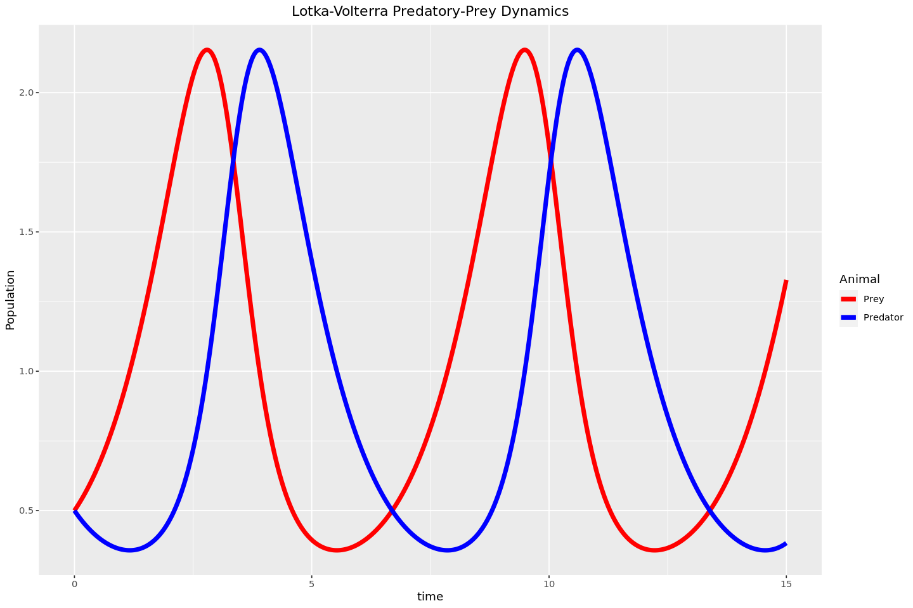
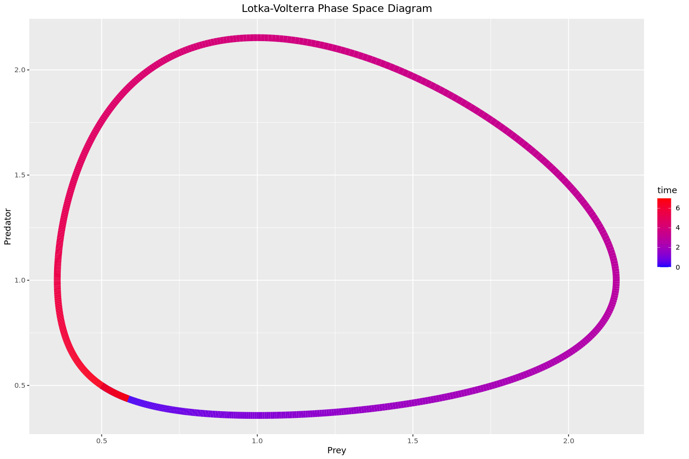
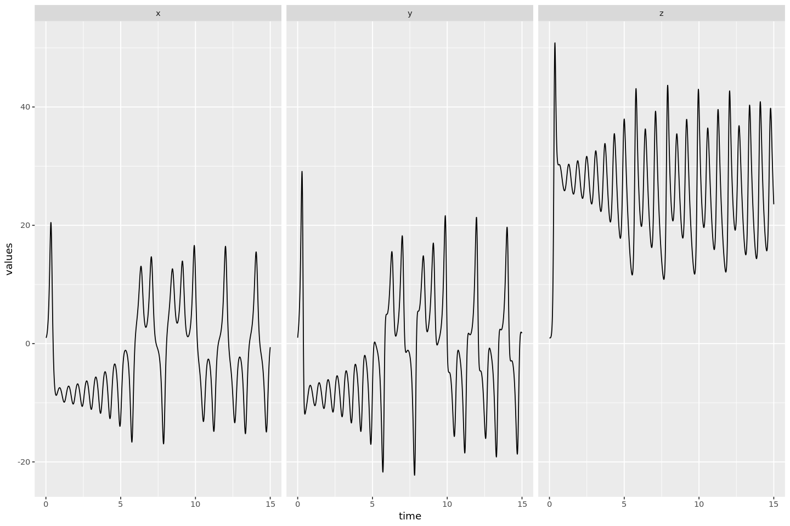
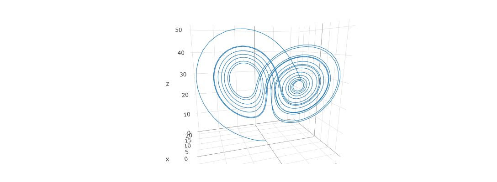

This post is a repeat of my [earlier post](/2022-07-04-solving-odes-with-python/) on solving initial value problems, but now using the [deSolve](https://cran.r-project.org/web/packages/deSolve/index.html) package ([documentation](https://cran.r-project.org/web/packages/deSolve/deSolve.pdf)).

```R
library(deSolve)
library(ggplot2)

options(repr.plot.width=12, repr.plot.height=8)
```

## Solving Linear Growth

The first, and simplest, system that we'll solve is linear growth. This system is given by

$$
\frac{dy}{dt} = a*y
$$

For simplicity, we'll choose $a=1$. Of course, we can easily solve this exactly - the solution is $y(t) = y_0 e^{at}$. Now let's see how we can solve it numerically.

For ordinary differently equations, the `deSolve` package provides the `ode` function. This function takes in the initial state (`y=`), the times (`times=`), any parameters to be passed into the system itself (`parms=`), and a function `func` representing the system. The function `func` has signature `func(t, state, parameters)`, where

-   `t` is the current time of the system
-   `state` is the current state of the system (i.e. the value of all variables)
-   `parameters` represents any parameters to the system
    The function should return a list of time derivatives of the variables.

```R
parameters <- c(a=1) # here the growth rate is 1
state <- c(y=1) # initial state is 1
times <- seq(0, 5, by=0.1)
# Function which takes the current state and returns a list of derivatives
linearGrowth <- function(t, state, parameters) {
    with(as.list(c(state, parameters)),{
        dydt <- a * y
        list(dydt)
    })
}
```

While most of this is relatively straightforward, there is one wrinkle - the `with` function. What this does is make the variables and parameters stored in `state` and `parameters` respectively available using just their names, rather than having to access them using `parameters[['a']]` or whatnot. Although confusing at first, [the R documentation](https://www.rdocumentation.org/packages/base/versions/3.6.2/topics/with) does a good job of explaining how it works.

```R
out <- ode(y=state, times=times, func=linearGrowth, parms=parameters)
head(out)
```

<table class="dataframe">
<caption>A matrix: 6 × 2 of type dbl</caption>
<thead>
	<tr><th scope=col>time</th><th scope=col>y</th></tr>
</thead>
<tbody>
	<tr><td>0.0</td><td>1.000000</td></tr>
	<tr><td>0.1</td><td>1.105171</td></tr>
	<tr><td>0.2</td><td>1.221403</td></tr>
	<tr><td>0.3</td><td>1.349861</td></tr>
	<tr><td>0.4</td><td>1.491827</td></tr>
	<tr><td>0.5</td><td>1.648723</td></tr>
</tbody>
</table>

```R
# convert to a dataframe for graphing
df <- data.frame(time=out[,"time"], y=out[,'y'])
head(df)
```

<table class="dataframe">
<caption>A data.frame: 6 × 2</caption>
<thead>
	<tr><th></th><th scope=col>time</th><th scope=col>y</th></tr>
	<tr><th></th><th scope=col>&lt;dbl&gt;</th><th scope=col>&lt;dbl&gt;</th></tr>
</thead>
<tbody>
	<tr><th scope=row>1</th><td>0.0</td><td>1.000000</td></tr>
	<tr><th scope=row>2</th><td>0.1</td><td>1.105171</td></tr>
	<tr><th scope=row>3</th><td>0.2</td><td>1.221403</td></tr>
	<tr><th scope=row>4</th><td>0.3</td><td>1.349861</td></tr>
	<tr><th scope=row>5</th><td>0.4</td><td>1.491827</td></tr>
	<tr><th scope=row>6</th><td>0.5</td><td>1.648723</td></tr>
</tbody>
</table>

```R
ggplot(df, aes(time, y)) + geom_point() + geom_line()
```


From this, it seems like our numerical solution to this system is pretty good. But how good is it? Since we can solve this system exactly, we can actually compute the maximum deviation that the numerical solution produced:

```R
df['exact'] <- exp(df['time'])
max(abs(df['y'] - df['exact']))
```

0.000236225065123108

So our numerical approximation is pretty good!

## Two Variables - Lotka-Volterra

Now let's make this a little more complicated by moving to the two-variable Lotka-Volterra system. This system is given by

$$
\begin{align*}
\frac{dx}{dt} &= x(b - py) \\
\frac{dy}{dt} &= y(rx - d) \\
\end{align*}
$$

Where

-   $x$ is the population of the prey species
-   $y$ is the population of the predator species

And the parameter

-   $b$ represents the growth rate of the prey species in the absence of predation
-   $p$ has something to do with how often / likely it is that the predator species eats the prey species
-   $r$ has something to do with how much food each member of the prey species provides
-   $d$ is the death rate of the predator species

Luckily, our approach to solving this hardly has to change at all.

```R
lotkaVolterra <- function(t, state, parameters) {
    with(as.list(c(state, parameters)), {
        dxdt <- x * (b - p * y)
        dydt <- y * (r * x - d)
        list(c(dxdt, dydt))
    })
}
parameters <- c(b=1, p=1, r=1, d=1)
state <- c(x=0.5, y=0.5)
times <- seq(0, 15, by=0.01)

out <- ode(y=state, times=times, parms=parameters, func=lotkaVolterra)
```

```R
# again, converting to a dataframe for graphing
df <- data.frame(time=out[,'time'], x=out[,'x'], y=out[,'y'])
head(df)
```

<table class="dataframe">
<caption>A data.frame: 6 × 3</caption>
<thead>
	<tr><th></th><th scope=col>time</th><th scope=col>x</th><th scope=col>y</th></tr>
	<tr><th></th><th scope=col>&lt;dbl&gt;</th><th scope=col>&lt;dbl&gt;</th><th scope=col>&lt;dbl&gt;</th></tr>
</thead>
<tbody>
	<tr><th scope=row>1</th><td>0.00</td><td>0.5000000</td><td>0.5000000</td></tr>
	<tr><th scope=row>2</th><td>0.01</td><td>0.5025125</td><td>0.4975125</td></tr>
	<tr><th scope=row>3</th><td>0.02</td><td>0.5050502</td><td>0.4950498</td></tr>
	<tr><th scope=row>4</th><td>0.03</td><td>0.5076131</td><td>0.4926119</td></tr>
	<tr><th scope=row>5</th><td>0.04</td><td>0.5102014</td><td>0.4901987</td></tr>
	<tr><th scope=row>6</th><td>0.05</td><td>0.5128152</td><td>0.4878099</td></tr>
</tbody>
</table>

In order to see what is going on with our solution, we'll first plot both the predator and prey populations against the time.

```R
ggplot(df, aes(x=time)) +
    geom_line(aes(y=x, colour="x"), linewidth=2) +
    geom_line(aes(y=y, colour="y"), linewidth=2) +
    guides(colour=guide_legend(title="Animal")) +
    scale_colour_manual(labels=c("Prey", "Predator"), values=c("red", "blue")) +
    ylab("Population") +
    ggtitle("Lotka-Volterra Predatory-Prey Dynamics") +
    theme(plot.title=element_text(hjust=0.5))
```



From this, is seems like the system demonstrates some periodic behaviour. Just by eyeballing this graph, it seems like the period is roughly seven years. To see this more clearly, let's now plot the prey population against the predator one for about one cycle.

```R
ggplot(df[df['time'] < 7,], aes(x, y, colour=time)) +
	scale_colour_gradient(low='blue', high='red', aesthetics='colour') +
	geom_path(linewidth=4) +
	labs(title="Lotka-Volterra Phase Space Diagram") +
	theme(plot.title = element_text(hjust=0.5)) +
	xlab("Prey") +
	ylab("Predator")
```



This make it far more clear that the system is periodic.

## 3 Variables - Lorenz System

Let's take this up another dimension by seeing the chaotic behaviour of the Lorenz system. This set of differential equations is given by

$$
\begin{align*}
\frac{dx}{dt} &= \sigma(y - x) \\
\frac{dy}{dt} &= x(\rho - z) - y \\
\frac{dz}{dt} &= xy - \beta z \\
\end{align*}
$$

with $\sigma=10$, $\beta=\frac{8}{3}$, and $\rho = 28$ (as originally used by Lorenz).

```R
parameters <- c(sigma=10, beta=8/3, rho=28)
state <- c(x=1, y=1, z=1)

lorenz <- function(t, state, parameters) {
    with(as.list(c(state, parameters)), {
        dxdt <- sigma * (y - x)
        dydt <- x * (rho - z)
        dzdt <- x * y - beta * z
        list(c(dxdt, dydt, dzdt))
    })
}

out <- ode(y=state, times=times, parms=parameters, func=lorenz)
head(out)
```

<table class="dataframe">
<caption>A matrix: 6 × 4 of type dbl</caption>
<thead>
	<tr><th scope=col>time</th><th scope=col>x</th><th scope=col>y</th><th scope=col>z</th></tr>
</thead>
<tbody>
	<tr><td>0.00</td><td>1.000000</td><td>1.000000</td><td>1.0000000</td></tr>
	<tr><td>0.01</td><td>1.013094</td><td>1.271264</td><td>0.9849476</td></tr>
	<tr><td>0.02</td><td>1.051045</td><td>1.549600</td><td>0.9733735</td></tr>
	<tr><td>0.03</td><td>1.112475</td><td>1.841490</td><td>0.9658361</td></tr>
	<tr><td>0.04</td><td>1.196745</td><td>2.153138</td><td>0.9631516</td></tr>
	<tr><td>0.05</td><td>1.303855</td><td>2.490648</td><td>0.9664250</td></tr>
</tbody>
</table>

```R
# convert to dataframe
df <- data.frame(
    time=out[,'time'],
    x=out[,'x'],
    y=out[,'y'],
    z=out[,'z']
)
head(df)
```

<table class="dataframe">
<caption>A data.frame: 6 × 4</caption>
<thead>
	<tr><th></th><th scope=col>time</th><th scope=col>x</th><th scope=col>y</th><th scope=col>z</th></tr>
	<tr><th></th><th scope=col>&lt;dbl&gt;</th><th scope=col>&lt;dbl&gt;</th><th scope=col>&lt;dbl&gt;</th><th scope=col>&lt;dbl&gt;</th></tr>
</thead>
<tbody>
	<tr><th scope=row>1</th><td>0.00</td><td>1.000000</td><td>1.000000</td><td>1.0000000</td></tr>
	<tr><th scope=row>2</th><td>0.01</td><td>1.013094</td><td>1.271264</td><td>0.9849476</td></tr>
	<tr><th scope=row>3</th><td>0.02</td><td>1.051045</td><td>1.549600</td><td>0.9733735</td></tr>
	<tr><th scope=row>4</th><td>0.03</td><td>1.112475</td><td>1.841490</td><td>0.9658361</td></tr>
	<tr><th scope=row>5</th><td>0.04</td><td>1.196745</td><td>2.153138</td><td>0.9631516</td></tr>
	<tr><th scope=row>6</th><td>0.05</td><td>1.303855</td><td>2.490648</td><td>0.9664250</td></tr>
</tbody>
</table>

```R
# 'melt' the dataframe for graphing
melted_df <- cbind(df['time'], stack(df[c('x', 'y', 'z')]))
head(melted_df)
```

<table class="dataframe">
<caption>A data.frame: 6 × 3</caption>
<thead>
	<tr><th></th><th scope=col>time</th><th scope=col>values</th><th scope=col>ind</th></tr>
	<tr><th></th><th scope=col>&lt;dbl&gt;</th><th scope=col>&lt;dbl&gt;</th><th scope=col>&lt;fct&gt;</th></tr>
</thead>
<tbody>
	<tr><th scope=row>1</th><td>0.00</td><td>1.000000</td><td>x</td></tr>
	<tr><th scope=row>2</th><td>0.01</td><td>1.013094</td><td>x</td></tr>
	<tr><th scope=row>3</th><td>0.02</td><td>1.051045</td><td>x</td></tr>
	<tr><th scope=row>4</th><td>0.03</td><td>1.112475</td><td>x</td></tr>
	<tr><th scope=row>5</th><td>0.04</td><td>1.196745</td><td>x</td></tr>
	<tr><th scope=row>6</th><td>0.05</td><td>1.303855</td><td>x</td></tr>
</tbody>
</table>

The first way that we'll examine this is through plots of each individual variable `x`, `y`, and `z` against the time.

```R
ggplot(melted_df, aes(x=time, y=values)) +
	geom_line() +
	facet_wrap(~ind)
```



It's a little hard to tell anything from these! To better see the behaviour, we should plot this in 3D. To do so, we'll use [plotly](https://plotly.com/r/) for R to see th results in three dimensions.

```R
library(plotly)
plot_ly(df, x=~x, y=~y, z=~z, type='scatter3d', mode='lines')
```



## Conclusion

There we have it - several examples of solving initial value problem using the `deSolve` library! The API for this library is quite nice, and as you can see, the set ups for each different system are remarkably similar to each other. The documentation for this library is also very nicely laid out with clear examples and good explanations of not only what they are doing, but why they're doing it.

## Sources / Further Reading

-   [deSolve Package (CRAN)](https://cran.r-project.org/web/packages/deSolve/index.html)
-   [plotly](https://plotly.com/r/3d-line-plots/)
-   [R Documentation - with](https://www.rdocumentation.org/packages/base/versions/3.6.2/topics/with)
