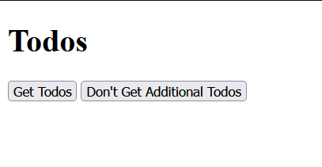
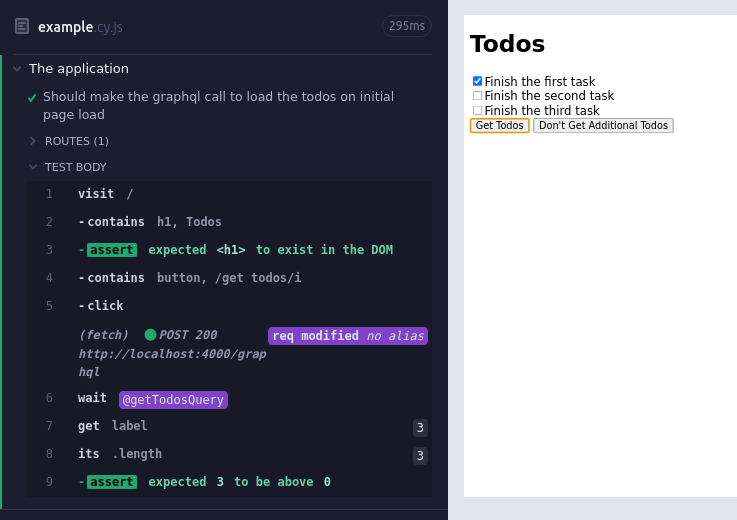
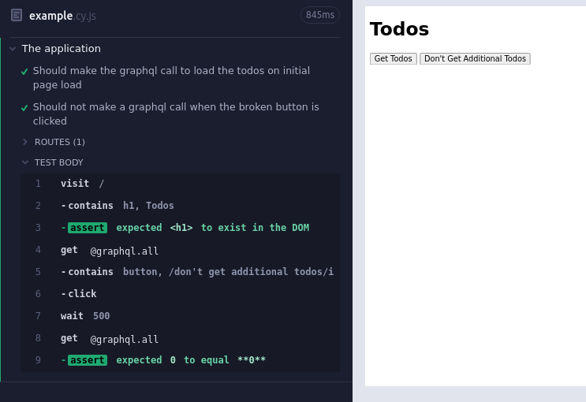

As part of my continuing testing efforts, I recently came across a problem for which I couldn't find an easy answer. As such, I thought that I should document my solution here, in the hopes that it saves someone else some trouble.

Normally, I don't test whether or not a query is made. Instead, I tend to look for the resulting changes in the user interface. However, recently I needed to test a feature of a program where a graphQL call was made, but that resulted in no change to the UI. In my case, I needed to log when a user visited a page for the first time. This required testing two things: first, that the appropriate graphQL call was made the first time they visited, and second, and just as important, verifying that the graphQL call was _not_ made the second (or subsequent) time.

In the rest of this post, I'll use a very simple example project to demonstrate how both of these can be achieved! If you just want the solution, you can find the complete project at [its github page](https://github.com/EricRobertCampbell/cypress-graphql-testing-example) and the [testing files there too](https://github.com/EricRobertCampbell/cypress-graphql-testing-example/blob/main/frontend/cypress/e2e/example.cy.js).

## Basic Setup

The initial project we'll test is quite simple. The backend is an [express](https://expressjs.com/) server which serves graphQL at `/graphql`. There is only a single query, which returns a list of todos.

`embed:resources/server.js`

The frontend has a button which fetches and displays the todos, along with another button that does nothing.

First there are no todos.


And then you fetch some.


Our goal here will be to write some test tooling to test that the buttons do what they should.

## Validating That a GraphQL Call Was Made

In order to validate that a graphQL call was made when we press the button, we are going to use [Cypress intercept](https://docs.cypress.io/api/commands/intercept). The basic syntax that we'll use is

```javascript
cy.intercept(url, handler);
```

The issue that we have is that all of our calls are made to the same url: `/graphql`! This example is a bit contrived, since there is actually only one potential kind of call that we could made (the one that fetches the todos), but normally you'd have lots of different operations to discriminate between. Luckily, there is some help on the Cypress website for [dealing with graphQL calls](https://docs.cypress.io/guides/end-to-end-testing/working-with-graphql). The basic idea behind what we'll do is to intercept all graphQL calls, and check each of them for the `operationName` atribute, which should allow us to discriminate between the different kinds of calls. According to the [official graphQL documentation](https://graphql.org/learn/queries/#operation-name), the operation name is optional but highly recommended, and all client-side graphQL libraries that I've used include it. Once we find a query that matches our operation name, we alias that query, allowing us to later use the [Cypress wait](https://docs.cypress.io/api/commands/wait) function to ensure that it was called.

The code for the entire test is here:

`embed:./resources/example-1.cy.js`

And the result of running it:



## Validating That a GraphQL Call Was _Not_ Made

This ends up being much trickier. I found a [solution that was very close](https://stackoverflow.com/a/68208768) on StackOverflow which relied on getting all of the interceptions for a particular route, and then testing that the length was 0. This doesn't quite work in our situation for the simple reason that our alias is not registered until _after_ the query is made. Thus, trying to use `get` on it fails. Additionally, for the use case that I had in mind, I didn't want the number of calls to be 0 - I just wanted it to be the same as it was before I navigated there.

The solution that I came up with works by aliasing the entire graphQL query, counting the number of interceptions that match a given criterion (in this case, have the right `operationName`), taking some sort of action, then counting the number of subsequent calls matching that same filter criterion and asserting that they have the same length.

The updated code (including both tests) is here:

`embed:./resources/example-2.cy.js`

And the result of running the test is here:



## Conclusion

Using the functions and methods displayed above, we can now test whether or not specific graphQL calls were made. Although I've only just started to use them, I've already found them incredibly useful. One advantage which I didn't expect is that because of the flexibility of the matching, I don't need to just test that a call with the right operation name wasn't made - I can test on any condition! For instance, I can check that no call with a particular set of variables was made (e.g. complete vs. incomplete submissions). I've also found that using `cy.wait` in conjunction with aliasing the right graphQL alias has helped to reduce the amount of test flake and helped with error messages, since the timeout for `wait`ing on network calls is quite long and I can also tell right away whether the issue is with the network call itself (e.g. my backend is failing) or with the subsequent UI changes that should occur.

Hopefully this helps you if you have run into the same sort of issue!
