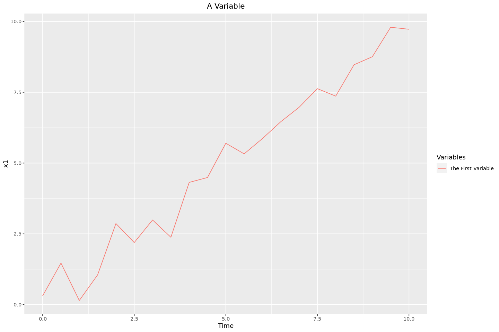
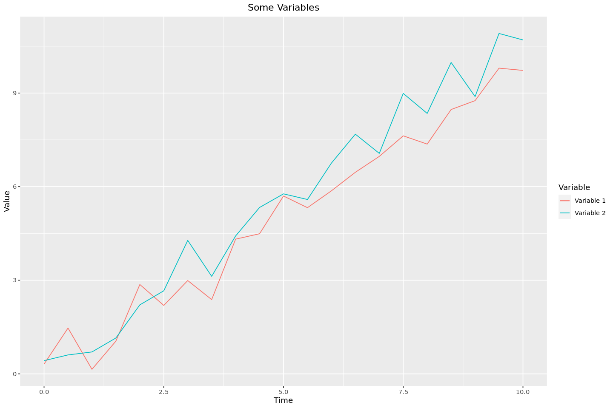
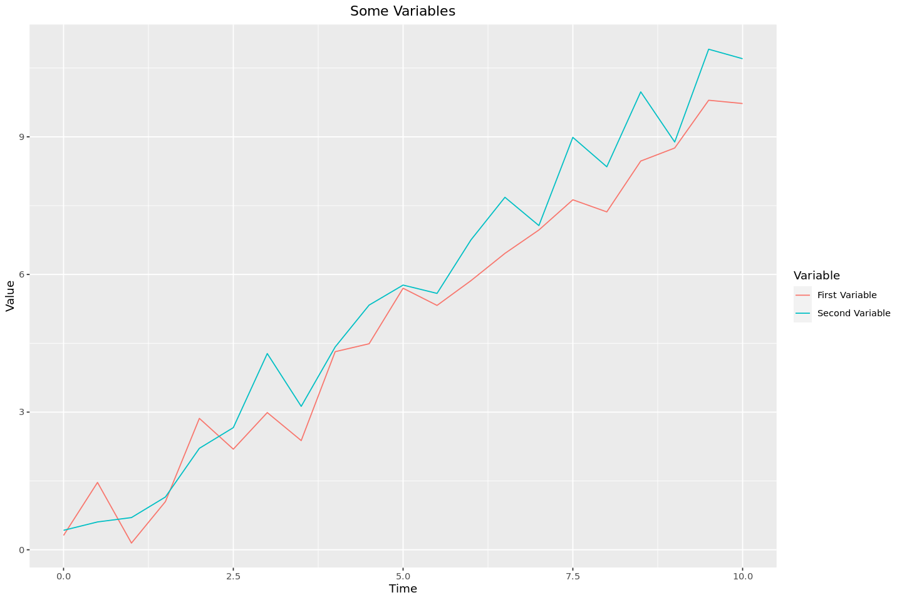

While working on something else, I came across the problem of graphing multiple lines on the same set of axes using [ggplot2](https://ggplot2.tidyverse.org/). I did not find it nearly as straightforward as I expected (largely due to my limited experience with R in general and ggplot2 in particular), so this serves as an archive of how to do this!

## Creating and Labelling a Single Line

Creating and labelling a single line is relatively straightforward, although it took me a while to get used to the `ggplot2` way of doing things. Most of my graphing experience is with [tikz (LaTeX)](https://github.com/pgf-tikz/pgf) and [matplotlib (Python)](https://matplotlib.org/), so wrapping my head around mappings and different layers took a while, and to be honest, I am still not particularly comfortable with it. Nonetheless, here is how we can graph a single line and add custom labels to the legend.

```R
# Load the library and set the options
library(ggplot2)

options(repr.plot.width=12, repr.plot.height=8)
```

```R
times <- seq(0, 10, by=0.5)
x1 <- rnorm(n=length(times), mean=times, sd=0.5) # line centred around y = x but with some error
df <- data.frame(time=times, x1=x1)
head(df)
```

<table class="dataframe">
<caption>A data.frame: 6 × 2</caption>
<thead>
	<tr><th></th><th scope=col>time</th><th scope=col>x1</th></tr>
	<tr><th></th><th scope=col>&lt;dbl&gt;</th><th scope=col>&lt;dbl&gt;</th></tr>
</thead>
<tbody>
	<tr><th scope=row>1</th><td>0.0</td><td>0.3129191</td></tr>
	<tr><th scope=row>2</th><td>0.5</td><td>1.4673592</td></tr>
	<tr><th scope=row>3</th><td>1.0</td><td>0.1460783</td></tr>
	<tr><th scope=row>4</th><td>1.5</td><td>1.0497238</td></tr>
	<tr><th scope=row>5</th><td>2.0</td><td>2.8634889</td></tr>
	<tr><th scope=row>6</th><td>2.5</td><td>2.1927241</td></tr>
</tbody>
</table>

```R
ggplot(df, aes(time, x1, colour="first")) + # without `colour` there would be no legend entry
	# In the above line, the actual value for 'colour' doesn't matter
	geom_line() + # graph a line
	labs(colour="Variables") + # The title of the legend
	scale_colour_discrete(labels="The First Variable") + # give a custom label to the single line
	# Without the above line the label would be 'x1', the name of the variable
	ylab("x1") +
	xlab("Time") +
	# the below two lines set and centre the title of the entire graph
	ggtitle("A Variable") +
	theme(plot.title=element_text(hjust=0.5))
```



## Multiple Lines

Graphing a single line and including a custom label in the legend wasn't too bad. However, when we get to multiple lines there are a few different ways. I will first describe how we can manually add different lines, and second how we can reshape the dataframe to have `ggplot2` do it for us.

### Manually Adding the Lines

In this method, I'll add the lines from the single, 'wide' dataframe using multiple calls to `geom_line`, each being manually assigned to the column of the dataframe from which it is getting the data.

```R
# Adding a second set of data to the frame
df$x2 <- rnorm(length(times), mean=times * 1.1, sd=0.5)
head(df)
```

<table class="dataframe">
<caption>A data.frame: 6 × 3</caption>
<thead>
	<tr><th></th><th scope=col>time</th><th scope=col>x1</th><th scope=col>x2</th></tr>
	<tr><th></th><th scope=col>&lt;dbl&gt;</th><th scope=col>&lt;dbl&gt;</th><th scope=col>&lt;dbl&gt;</th></tr>
</thead>
<tbody>
	<tr><th scope=row>1</th><td>0.0</td><td>0.3129191</td><td>0.4240040</td></tr>
	<tr><th scope=row>2</th><td>0.5</td><td>1.4673592</td><td>0.6065533</td></tr>
	<tr><th scope=row>3</th><td>1.0</td><td>0.1460783</td><td>0.7018993</td></tr>
	<tr><th scope=row>4</th><td>1.5</td><td>1.0497238</td><td>1.1500628</td></tr>
	<tr><th scope=row>5</th><td>2.0</td><td>2.8634889</td><td>2.2110318</td></tr>
	<tr><th scope=row>6</th><td>2.5</td><td>2.1927241</td><td>2.6622088</td></tr>
</tbody>
</table>

```R
ggplot(df, aes(x=time)) +
	# Manually adding the first line
	geom_line(aes(y=x1, colour="first")) +
	# Manually adding the second line
	geom_line(aes(y=x2, colour="second")) +
	labs(colour="Variable") +
	# Setting the custom variables
	# Without this, the labels would be 'x1' and 'x2'
	scale_colour_discrete(labels=c("Variable 1", "Variable 2")) +
	ggtitle("Some Variables") +
	theme(plot.title = element_text(hjust=0.5)) +
	xlab("Time") +
	ylab("Value")
```



### Method 2 - "Melting" the DataFrame

This method, which seems to be more idiomatic, involves transforming the dataframe from being 'wide', with each set of lines in their own separate columns, to being 'tall', with all of the different values being in the same column and using a different column as a key to allow `ggplot2` to tell which data points should be assigned to each different line.

```R
melted_df <- cbind(df['time'], stack(df[c('x1', 'x2')]))
head(melted_df)
```

<table class="dataframe">
<caption>A data.frame: 6 × 3</caption>
<thead>
	<tr><th></th><th scope=col>time</th><th scope=col>values</th><th scope=col>ind</th></tr>
	<tr><th></th><th scope=col>&lt;dbl&gt;</th><th scope=col>&lt;dbl&gt;</th><th scope=col>&lt;fct&gt;</th></tr>
</thead>
<tbody>
	<tr><th scope=row>1</th><td>0.0</td><td>0.3129191</td><td>x1</td></tr>
	<tr><th scope=row>2</th><td>0.5</td><td>1.4673592</td><td>x1</td></tr>
	<tr><th scope=row>3</th><td>1.0</td><td>0.1460783</td><td>x1</td></tr>
	<tr><th scope=row>4</th><td>1.5</td><td>1.0497238</td><td>x1</td></tr>
	<tr><th scope=row>5</th><td>2.0</td><td>2.8634889</td><td>x1</td></tr>
	<tr><th scope=row>6</th><td>2.5</td><td>2.1927241</td><td>x1</td></tr>
</tbody>
</table>

```R
# renaming the columns: 'values' -> 'value' and 'ind' -> 'variable'
colnames(melted_df)[colnames(melted_df) == 'values'] = "value"
colnames(melted_df)[colnames(melted_df) == 'ind'] = "variable"
```

```R
# This time the colour is set automatically by the `variable` column
ggplot(melted_df, aes(time, value, colour=variable)) +
	geom_line() +
	labs(colour="Variable") +
	scale_colour_discrete(labels=c("First Variable", "Second Variable")) +
	ggtitle("Some Variables") +
	theme(plot.title = element_text(hjust=0.5)) +
	xlab("Time") +
	ylab("Value")
```



## Conclusion

And there we have it! Several ways to graph and label different lines (and using methods analgous to these, other graph types) on the same set of axes. As is so often the case, looking back at this I can hardly believe that it caused me so much trouble. Perhaps the best lesson that can be drawn from this is that reading the documentation is key, as most the trouble I had was with my not understanding the basics of how `ggplot2` works.

## Sources and Further Reading

-   [DataNovia - GGPlot Legend, Title, Position and Labels](https://www.datanovia.com/en/blog/ggplot-legend-title-position-and-labels)
-   [Statology - Stack Columns in R](https://www.statology.org/stack-columns-in-r/)
-   [R Documentation - Stack](https://www.rdocumentation.org/packages/utils/versions/3.6.2/topics/stack)
-   [Online Book - ggplot2: Elegant Graphics for Data Analysis](https://ggplot2-book.org/)
