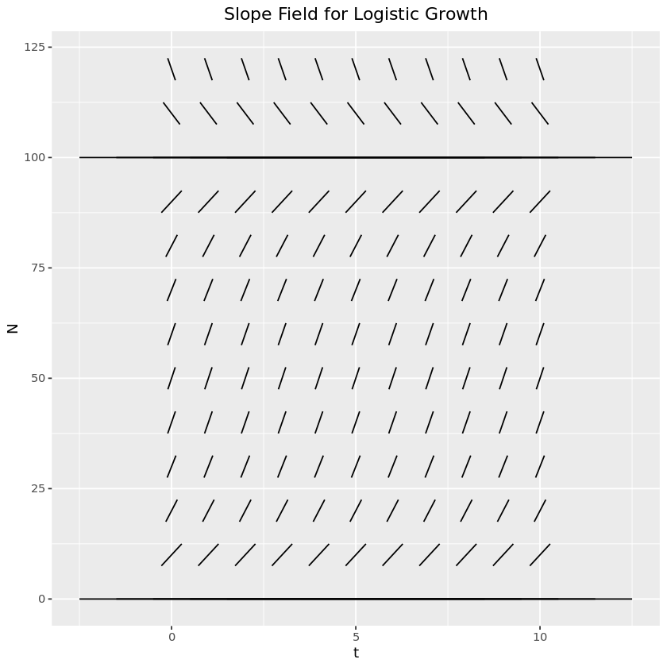

## Introduction and Explanation

Note: most of this is covered in Chapter 1 of (Murray, 2002).

The simplest model for the growth of a population of organisms is that given by linear growth. This model assumes the rate at which organisms grow / reproduce is proportional to the number that currently exist. For example, imagine a bacterial culture where each bacterium buds into two daughter. This can be represented as a differential equation.

$$
\frac{dN}{dt} = rN,\, N(0)=N_0
$$

Where $N(t)$ is the size of the population at a time $t$, $r$ is the growth rate, and $N_0$ is the initial population size. The solution to this is given by $N(t) = N_0e^{rt}$. I've written about this model [before](2021-08-16-exponentialGrowth/).

While this model has the virtue of simplicity, it is not particularly realistic. The size of the population, assuming that the growth rate $r$ is positive, quickly reaches ludicrous levels. As such, we need a better model!

One such model, which accounts for the depletion of resources, accumulation of wastes, and other such inhibitors of growth that appear as the population grows, is the [logistic model](https://en.wikipedia.org/wiki/Logistic_function#history). The reasoning behind this model is that in the absence of any inhibiting factors, the population will grow as per the linear model. However, as the population grows, there is a factor that accounts for the slowing growth caused by depletion of resources, &c. As a differential equation, this looks as follows:

$$
\frac{dN}{dt} = \underbrace{rN}_{\text{Linear growth}}\overbrace{\left( 1 - \frac{N}{K} \right)}^{\text{Inhibiting factor}}
$$

where $r$ is the growth rate (as in the linear model) and $K$ is the carrying capacity.

## Stationary Points

From the above equation, the system has two stationary points: $N = 0$ and $N = K$. Intuitively, these make sense: if there is no initial population, we don't expect spontaneous generation to create one. Similarly, if the population is exactly at the carrying capacity, then we expect it to remain constant. We can also see that if $N$ is slightly larger than $K$, the derivative is negative - the population will decrease towards the carrying capacity. If $N$ is slightly smaller than $K$, then the derivative will be positive, and the population will increase towards the carrying capacity.

Let's take a look at the slope field for this system, settings $r=1$ and $K=100$:

```R
library(ggplot2)

len <- 5
diff <- function(N) N * (1 - N / 100)

ts = seq(0, 10, by=1)
Ns = seq(0, 120, by=10)

df <- expand.grid(t=ts, N=Ns)
df$m <- diff(df$N)
df$theta <- atan(df$m)
df$xstart <- df$t - 0.5 * len * cos(df$theta)
df$ystart <- df$N - 0.5 * len * sin(df$theta)
df$xend <- df$t + 0.5 * len * cos(df$theta)
df$yend <- df$N + 0.5 * len * sin(df$theta)

ggplot(df) +
    geom_segment(aes(x=xstart, y=ystart, xend=xend, yend=yend)) +
    xlab("t") +
    ylab("N") +
    ggtitle("Slope Field for Logistic Growth") +
    theme(plot.title=element_text(hjust=0.5))

```



This makes it look like the stationary point $N=0$ is unstable and $N=K$ is stable. Now let's justify that algebraically. To do that, we'll [linearize](<https://eng.libretexts.org/Bookshelves/Industrial_and_Systems_Engineering/Book%3A_Chemical_Process_Dynamics_and_Controls_(Woolf)/10%3A_Dynamical_Systems_Analysis/10.02%3A_Linearizing_ODEs>) the equation by taking a Taylor series about each of the stationary points and dropping all but the first two terms. When we do this, we find that a system (in general, not just this one) is stable if the second derivative at that point is negative and unstable if it is positive.

Say that $N^{*}$ is a stationary point of $\frac{dN}{dt} = f(N)$ so that $f(N^{*}) = 0$. Let's consider $\delta(t) = N(t) - N^{*}$, the difference between the current population and the stationary point. Then

$$
\begin{align*}
\frac{d\delta}{dt} &= \frac{dN}{dt} - \underbrace{\frac{dN^{*}}{dt}}_{\text{0, since $N^{*}$ is constant}} \\
                   &= \frac{dN}{dt} \\
                   &= f(N) \\
                   &= f(\delta + N^{*}) \\
\end{align*}
$$

Then we can expand the Taylor series for $\frac{d\delta}{dN}$ around $N^{*}$

$$
\begin{align*}
\frac{d\delta}{dt} &= f(N) \\
    &= f(N^{*}) + f^{\prime}(N^{*})(N - N^{*}) + f^{\prime\prime}(N^{*})(N - N^{*})^2 + \dots \\
    &\approx f(N^{*}) + f^{\prime}(N^{*})(N - N^{*}) & \text{Linear approximation} \\
    &= 0 + f^{\prime}(N^{*})(N - N^{*}) & \text{$N^*$ is a stationary point} \\
    &= f^{\prime}(N^{*})(\delta + N^* - N^{*}) \\
    &= f^\prime(N^*)\ast \delta
\end{align*}
$$

So then we have that, at least in a small region around the equilibrium point, $\frac{d\delta}{dt} = f^\prime(N^*)\ast \delta \to \delta(t) = Ae^{f^\prime(N^*)t}$. From this, it is clear that if $f^\prime (N^*) > 0$, then this is exponential growth - the difference between the population and the equilibrium population will grow rapidly, and so the solution is unstable. On the other hand, if $f^\prime (N^*) < 0$, then this is exponential _decay_, and so the difference between the population and the equilibrium population will go to zero - the solution is stable.

For our particular system, $f^\prime(N) = \frac{d}{dt} rN \left( 1 - \frac{N}{K} \right) = r - \frac{2r}{K}N$. So, for the two equilibrium points:

-   $f^\prime(0) = r > 0 \to$ the equilibrium at 0 is _unstable_.
-   $f^\prime(N) = -r  < 0 \to$ the equilibrium at $K$ is _stable_.

Thus, we've confirmed algebraically what our intuition and the slope field diagram led us to expect.

## Solution

Luckily for us, we can solve this exactly by using a separation of variables.

$$
\begin{align*}
\frac{dN}{dt} &= rN\left( 1 - \frac{N}{K} \right) \\
\frac{dN}{N\left( 1 - \frac{N}{K} \right)} &= r dt \\
\underbrace{\int \frac{dN}{N\left( 1 - \frac{N}{K} \right)}}_{\text{LHS}} &= \int r dt \tag{1} \end{align*}
$$

To solve the left hand side (LHS), we can find the [partial fraction decomposition](https://www.mathsisfun.com/algebra/partial-fractions.html) of the integrand:

$$
\begin{align*}
\frac{1}{N\left( 1 - \frac{N}{K} \right)} &= \frac{A}{N} + \frac{B}{1-\frac{N}{K}} \\
1 &= A\left(1 - \frac{N}{K}\right) + BN \\
1 &= A + N\left(B - \frac{A}{K} \right) \\
\therefore A=1,\ &B=\frac{1}{K}
\end{align*}
$$

So now, continuing on from (1),

$$
\begin{align*}
\int \frac{dN}{N\left( 1 - \frac{N}{K} \right)} &= \int r dt \\
\int \frac{1}{N} + \frac{1/K}{1 - \frac{N}{K}}dN &= \int r dt \\
\int \frac{1}{N} + \frac{1}{K - N}dN &= \int r dt \\
\ln |N| - \ln |K - N| &= rt + C \\
\ln \left| \frac{N}{K - N} \right| &= rt + C \\
\frac{N}{K - N} &= \begin{cases}
    Ae^{rt} & N < K \\
    -Ae^{rt} & N > K \\
\end{cases} \\
\end{align*}
$$

For the case where $N < K$:

$$
\begin{align*}
N(1 + Ae^{rt}) &= KAe^{rt} \\
N &= \frac{KAe^{rt}}{1 + AE^{rt}} \\
  &= \frac{Ke^{rt}}{\frac{1}{A} + e^{rt}}
\end{align*}
$$

By the same process, when $N > K$, $N(t) = \frac{Ke^{rt}}{-\frac{1}{A} + e^{rt}}$.

If we have that $N(0) = N_0$, then for the case where $N < K$,

$$
\begin{align*}
N_0 &= N(0) = \frac{K}{\frac{1}{A} + 1} \\
\frac{1}{A} + 1 &= \frac{K}{N_0} \\
\frac{1}{A} &= \frac{K}{N_0} - 1 \\
\end{align*}
$$

And so putting this all together, we have that

$$
\begin{align*}
N(t) &= \frac{Ke^{rt}}{\frac{K}{N_0} - 1 + e^{rt}} \\
    &= \frac{N_0 K e^{rt}}{K - N_ 0 + N_0 e^{rt}} \\
    &= \frac{N_0 K e^{rt}}{K + N_0 ( e^{rt} - 1)}
\end{align*}
$$

Similar logic for the case $N > K$ gives the identical solution (which feels slightly miraculous).

## Nondimensional Form

The last thing I'd like to do is to write down the [nondimensional form](https://en.wikipedia.org/wiki/Nondimensionalization) of the equation. To do that, we'll first substitute in values of the variables in our system ($N$ and $t$) with normalized versions, $N^*$ and $t^*$, each of which is a multiple of the original variables. If we choose the multiplying constants correctly, we can remove all constants in the equation (like $r$ and $K$), leaving us with something just in terms of the variables themselves.

To see how this works, let's start with a simple example: linear growth.

$$
\frac{dN}{dt} = rN
$$

We'll make the substitutions $N = AN^*$, $t = bt^*$. Then

$$
\begin{align*}
\frac{dN}{dt} &= rN \\
\frac{d(AN*)}{d(Bt^*)} &= r(AN^*) \\
\frac{A}{B} \frac{dN^*}{dt^*} &= rAN^* \\
\frac{dN^*}{dt^*} &= \underbrace{rB}_{\text{Should $=1$}}N^* \\
\therefore rB &= 1 \to B = \frac{1}{r} \\
\end{align*}
$$

Thus, with the variable substitutions $N^* = N$ and $t^* = rt$, we have our nondimensional form. To verify:

$$
\begin{align*}
\frac{dN^*}{dt^*} &= \frac{1}{r}\frac{dN}{dt} \\
                &= \frac{1}{r} rN \\
                &= N \\
                &= N^* \\
        \therefore \frac{dN^*}{dt^*} &= N^* \\
\end{align*}
$$

In this case, we can think of our new variable $t^*$ are representing the 'characteristic time' of the system - that is, we measure time in terms of the time it takes to grow by a factor $e$. In some way, this is the natural way to measure time in this system.

Now let's try the same process using our actual equation. Again, we'll try the substitutions $N = AN^*$, $t = Bt^*$. Then

$$
\begin{align*}
\frac{dN}{dt} &= rN\left( 1 - \frac{N}{K} \right) \\
\frac{A}{B} \frac{dN^*}{dt^*} &= r (AN^*)\left( 1 - \frac{AN^*}{K} \right) \\
\frac{dN^*}{dt^*} &= \underbrace{rB}_{=1}N^* - \underbrace{\frac{rAB}{K}}_{=1}(N^*)^2 \\
\end{align*}
$$

So $B = \frac{1}{r}$ and $A = K$, giving us the subsitutions $N^* = \frac{N}{K}$ and $t^* = rt$. When we make this subsitution, we have the nondimensional form

$$
\frac{dN^*}{dt^*} = N^*(1 - N^*)
$$

Again, we can think of these as having physical significance. These subsititions mean that we are measuring time in terms of the characteristic growth rate time, and we are measuring population in terms of the carrying capacity.

## Conclusion

The logistic growth model, and the curve that arises from it naturally, are fascinating to look at. In this post, I've just scratched the surface - there are many other interesting things to learn about. The logistic function, as well as arising in various forms in many ecological systems, also arises in other, seemingly unrelated fields. For instance, it is often used in machine learning as well as in the [ranking of individuals](/2022-10-03-ranking/). Hopefully this helped to explain some of the properties of this system and the resulting function!

## Sources and Futher Reading

-   [Math is Fun - Partial Fractions](https://www.mathsisfun.com/algebra/partial-fractions.html)
-   Murray, J. D. (Ed.). (2002). Mathematical Biology: I. An Introduction (Vol. 17). Springer. https://doi.org/10.1007/b98868
-   [Wikipedia - Logistic Function](https://en.wikipedia.org/wiki/Logistic_function)
-   [Woolf 2002 - Chemical Process Dynamics and Control Chapter 10.2 - Linearizing ODEs](<https://eng.libretexts.org/Bookshelves/Industrial_and_Systems_Engineering/Book%3A_Chemical_Process_Dynamics_and_Controls_(Woolf)/10%3A_Dynamical_Systems_Analysis/10.02%3A_Linearizing_ODEs>)
